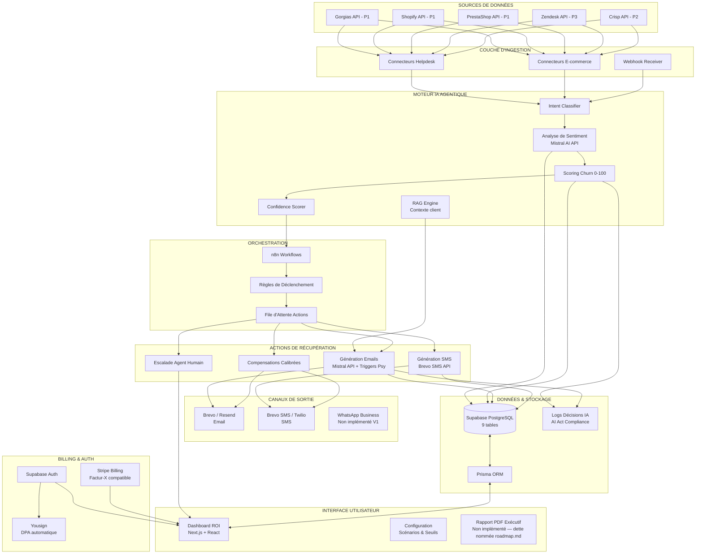
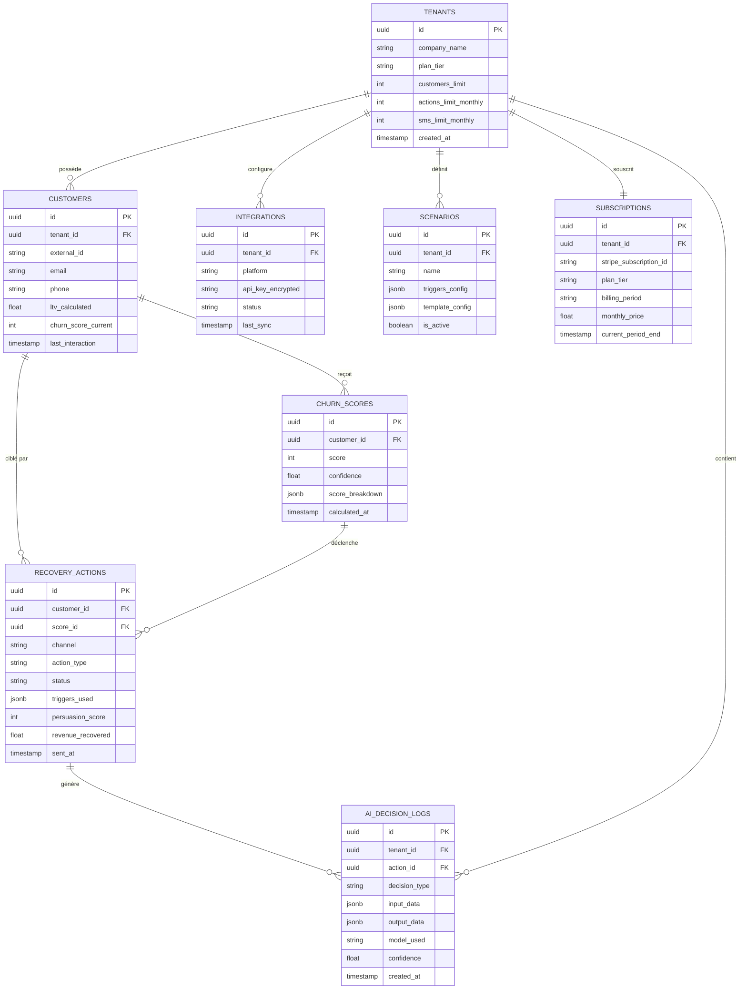

# Architecture Globale — WinBack Agent

> **Statut** : ✅ Validé
> **Priorité** : P1
> **Version** : 1.0
> **Dernière MAJ** : 2026-02-26

---

## 1. Objectif

Ce document décrit l'architecture technique globale de WinBack Agent : les composants du système, leurs interactions, les flux de données, et les choix d'infrastructure. Il sert de référence pour toutes les décisions de développement.

---

## 2. Vue d'Ensemble du Système

WinBack Agent est un **agent IA agentique** qui exécute une boucle autonome en 4 étapes :

```
DÉTECTER → QUALIFIER → AGIR → MESURER
```

Le système surveille en continu les interactions de service client, identifie les clients à risque de churn, déclenche des actions de récupération personnalisées, et mesure le ROI en euros de CA sauvé.

### 2.1 Principes Architecturaux

| Principe | Application |
|----------|-------------|
| **Agentique** | Le système agit de manière autonome après configuration initiale |
| **Multi-tenant** | Isolation stricte des données entre clients (RGPD) |
| **Event-driven** | Les actions sont déclenchées par des événements (nouveau ticket, CSAT bas, etc.) |
| **Modularité** | Chaque module est indépendant et communique via API internes |
| **Souveraineté** | Hébergement 100% France (OVHcloud), RGPD natif |
| **Observabilité** | Logs de toutes les décisions IA (conformité AI Act) |

---

## 3. Diagramme d'Architecture



---

## 4. Stack Technique Détaillée

### 4.1 Frontend

| Composant | Technologie | Version | Justification |
|-----------|-------------|---------|---------------|
| Framework | Next.js | 15.x | SSR + App Router, performance, écosystème React |
| UI Library | React | 19.x | Standard industrie, composants réutilisables |
| Language | TypeScript | 5.x | Typage statique, réduction des bugs |
| Styling | Tailwind CSS | 3.x | Utility-first, rapidité de développement |
| Composants UI | shadcn/ui | latest | Composants accessibles, personnalisables, pas de vendor lock-in |
| Charts ROI | Recharts ou Chart.js | latest | Visualisation CA sauvé, tendances, ROI |
| Hébergement | Vercel | — | Déploiement Next.js natif, CDN global, preview branches |

### 4.2 Backend & Base de Données

| Composant | Technologie | Version | Justification |
|-----------|-------------|---------|---------------|
| Base de données | Supabase (PostgreSQL) | latest | Auth intégré, Row Level Security, temps réel |
| ORM | Prisma | 5.x | Typage TypeScript natif, migrations, requêtes type-safe |
| Auth | Supabase Auth | — | JWT, multi-provider, RLS natif |
| Hébergement BDD | Supabase Cloud (EU) | — | Hébergement EU, backup automatique |
| Backend API | Next.js API Routes | — | Serverless, intégré au frontend, pas de serveur séparé |
| Backend lourd | OVHcloud VPS | — | Pour n8n + traitements IA longs, hébergement France |

### 4.3 IA & Orchestration

| Composant | Technologie | Version | Justification |
|-----------|-------------|---------|---------------|
| Moteur IA | Mistral AI API (Mistral AI SAS) | mistral-large-latest / mistral-small-latest | Fournisseur français, intra-France/UE, français natif — ADR-009 |
| IA fallback | OpenAI GPT-4o (backup) | — | Architecture multi-provider en cas d'indisponibilité |
| Orchestration workflows | n8n (self-hosted) | latest | Open-source, workflows visuels, webhooks natifs |
| Hébergement n8n | OVH VPS France | — | Souveraineté données, coût maîtrisé |

### 4.4 Services Externes

| Service | Usage |
|---------|-------|
| Brevo / Resend | Envoi emails de récupération |
| Brevo SMS / Twilio | Envoi SMS de récupération |
| Stripe | Facturation, abonnements, 3x sans frais |
| Yousign | Signature DPA automatique |
| Vercel | Hébergement frontend |
| OVH VPS | Backend + n8n |

---

## 5. Flux de Données Principaux

### 5.1 Flux 1 — Détection d'Insatisfaction (temps réel)

```
1. Événement source
   → Nouveau ticket Gorgias / email / chat entrant
   → Webhook reçu par n8n

2. Ingestion
   → n8n route vers le connecteur approprié
   → Extraction : contenu message, métadonnées client, historique

3. Analyse IA
   → Intent Classifier : catégorise le message (réclamation, question, feedback...)
   → Analyse de sentiment (Mistral API) : score -1.0 à +1.0
   → Enrichissement : historique achat (Shopify/PrestaShop), tickets précédents

4. Scoring Churn
   → Calcul du score 0-100 basé sur :
     • Sentiment du message (poids : 30%)
     • Fréquence réclamations 90 derniers jours (poids : 25%)
     • Valeur LTV du client (poids : 20%)
     • Délai de résolution moyen (poids : 15%)
     • Ancienneté client (poids : 10%)
   → Confidence Scorer : évalue la fiabilité du score (seuil : >70%)

5. Stockage
   → Score + analyse sauvegardés dans Supabase
   → Log décision IA (AI Act compliance)

6. Déclenchement
   → Si score > seuil configuré par le client (défaut : 65/100)
   → ET confidence > 70%
   → → Action de récupération déclenchée (Flux 2)
```

### 5.2 Flux 2 — Action de Récupération

```
1. Qualification
   → RAG Engine : récupère le contexte complet du client
     • Historique d'achats (via API e-commerce)
     • Tickets précédents et résolutions
     • Valeur LTV calculée
     • Profil émotionnel détecté

2. Sélection du scénario
   → Matching avec les scénarios configurés par le client WinBack
   → Sélection des triggers psychologiques appropriés :
     • Les 7 leviers (Loss Aversion, Réciprocité, Urgence, Social Proof, Ancrage Prix, Rareté, Personnalisation Ton) — tous inclus, sans restriction (ADR-017)

3. Génération du message
   → Mistral API génère l'email/SMS personnalisé
   → Paramètres : vouvoiement par défaut, ton de la marque, langue FR
   → Mention AI Act : "Message personnalisé avec l'assistance de notre IA"
   → Compensation calibrée : proportionnelle à la valeur LTV client
   → Score de persuasion 0-100 calculé

4. Validation & Envoi
   → Si mode "validation humaine" activé → notification au client WinBack
   → Sinon → envoi automatique via Brevo (email) ou Brevo SMS (SMS)
   → Canal : Email + SMS (350/mois, activés à la conversion — 0 en essai). Palier unique CoY (ADR-017).

5. Logging
   → Action enregistrée : message envoyé, triggers activés, score persuasion
   → Log décision IA complet (qui, quand, pourquoi, quel score, quel seuil)
   → Compteur quotas incrémenté (actions/mois)
```

### 5.3 Flux 3 — Mesure du ROI

```
1. Tracking post-action
   → Suivi ouverture email (pixel tracking)
   → Suivi clic SMS (lien tracké)
   → Suivi conversion : achat post-récupération (webhook Shopify/PrestaShop)

2. Attribution
   → Fenêtre d'attribution : 30 jours post-action
   → Règle : si le client effectue un achat dans les 30 jours
     après une action WinBack → CA attribué à WinBack

3. Calcul ROI
   → CA récupéré = Σ (achats des clients récupérés × multiplicateur achat répété)
   → Multiplicateur : 1,7x - 2,2x selon le secteur
     (source : benchmark interne beta + Fevad 2025)
   → ROI net = CA récupéré / coût abonnement WinBack

4. Dashboard
   → Mise à jour temps réel
   → Export CSV disponible — export PDF non implémenté (dette nommée roadmap.md)
   → Alertes seuil ROI configurables
```

---

## 6. Architecture Multi-Tenant

### 6.1 Isolation des Données

```
┌─────────────────────────────────────────────┐
│              SUPABASE PostgreSQL             │
│                                             │
│  ┌─────────────┐  ┌─────────────┐          │
│  │ Client A    │  │ Client B    │  ...      │
│  │ tenant_id=1 │  │ tenant_id=2 │          │
│  │             │  │             │          │
│  │ • customers │  │ • customers │          │
│  │ • scores    │  │ • scores    │          │
│  │ • actions   │  │ • actions   │          │
│  │ • logs_ia   │  │ • logs_ia   │          │
│  └─────────────┘  └─────────────┘          │
│                                             │
│  Row Level Security (RLS) sur TOUTES        │
│  les tables → un client ne peut JAMAIS      │
│  voir les données d'un autre client         │
└─────────────────────────────────────────────┘
```

### 6.2 Règles d'Isolation

| Règle | Implémentation |
|-------|---------------|
| Données client | RLS Supabase : `tenant_id = auth.uid()` sur chaque table |
| Modèle IA | Pas de cross-training entre clients — chaque analyse est isolée |
| API keys | Chaque client a ses propres clés d'intégration (Gorgias, Shopify...) |
| Logs IA | Logs filtrés par tenant, non partagés |
| Backups | Backup global Supabase, restauration possible par tenant |

---

## 7. Modèle de Données (Vue d'Ensemble)

> Détail complet dans `modele-donnees.md`

### 7.1 Schéma Relationnel (9 tables principales)



---

## 8. Gestion des Quotas — Palier Unique CoY (ADR-017)

### 8.1 Limites Techniques

| Ressource | CoY |
|-----------|-----|
| Clients surveillés | 10 000 |
| Actions récupération/mois | 1 500 |
| SMS/mois | 350 (0 en essai) |
| Intégrations | Illimitées |
| Scénarios | 25 personnalisables |
| Leviers comportementaux | Les 7, sans restriction |

### 8.2 Comportement au Dépassement

```
SI clients_surveilles > 10 000 :
  → À 90% : email d'alerte au client WinBack
  → À 100% : les nouveaux clients ne sont plus scorés, contact équipe pour offre personnalisée
  → PAS de facturation au dépassement (V1) — pas d'upgrade possible (palier unique)

SI actions_mensuelles > 1 500 :
  → Même logique de notification progressive
  → À 100% : les actions sont mises en file d'attente pour le mois suivant

SI sms_mensuels > 350 :
  → À 100% : fallback automatique vers email
  → Notification au client WinBack
```

---

## 9. Sécurité & Infrastructure

### 9.1 Architecture d'Hébergement

```
┌──────────────────────────────────────────────────────┐
│                    INTERNET                          │
└──────────────┬───────────────────┬───────────────────┘
               │                   │
    ┌──────────▼──────────┐  ┌────▼─────────────────┐
    │   Vercel (CDN)      │  │  OVH VPS France      │
    │                     │  │                       │
    │  • Next.js Frontend │  │  • n8n (workflows)   │
    │  • API Routes       │  │  • Workers IA        │
    │  • Edge Functions   │  │  • Cron jobs         │
    │                     │  │                       │
    │  SSL/TLS auto       │  │  SSL/TLS Let's Enc.  │
    └──────────┬──────────┘  └────┬─────────────────┘
               │                   │
    ┌──────────▼───────────────────▼───────────────────┐
    │              Supabase Cloud (EU)                  │
    │                                                   │
    │  • PostgreSQL (données métier)                   │
    │  • Auth (JWT + RLS)                              │
    │  • Storage (fichiers, exports PDF)               │
    │  • Realtime (dashboard temps réel)                │
    └───────────────────────────────────────────────────┘
```

### 9.2 Mesures de Sécurité

| Mesure | Détail |
|--------|--------|
| Chiffrement transit | TLS 1.3 sur tous les endpoints |
| Chiffrement repos | PostgreSQL encryption at rest (Supabase) |
| API keys clients | Chiffrées en base (AES-256), jamais en clair |
| Auth | JWT Supabase + refresh token rotation |
| RLS | Row Level Security sur 100% des tables |
| Logs IA | Immuables, horodatés, non modifiables |
| DPA | Signé automatiquement via Yousign à l'inscription |
| RGPD | Droit à l'oubli : endpoint de suppression complète par tenant |
| Backups | Automatiques quotidiens (Supabase), rétention 30 jours |

---

## 10. Performance & Scalabilité

### 10.1 Objectifs de Performance

| Métrique | Objectif | Justification |
|----------|----------|---------------|
| Temps d'analyse sentiment | < 3 secondes | Mistral API response time moyen |
| Temps de scoring churn | < 5 secondes | Analyse + enrichissement contexte |
| Temps de génération email | < 8 secondes | Mistral API + template + personnalisation |
| Latence dashboard | < 500ms | Standard UX SaaS |
| Uptime | 99,5% | Standard SaaS B2B PME |
| Capacité simultanée | 100 tenants actifs | Objectif Année 1 |

### 10.2 Stratégie de Scalabilité

```
Phase 1 (0-50 clients) :
  → Supabase Free/Pro + 1 VPS OVH + Vercel Free
  → Suffisant pour les 6 premiers mois

Phase 2 (50-200 clients) :
  → Supabase Pro + VPS OVH renforcé + Vercel Pro
  → Ajout cache Redis pour les scores fréquemment accédés

Phase 3 (200+ clients) :
  → Migration vers architecture microservices si nécessaire
  → Supabase Team/Enterprise
  → Load balancer + multiple workers n8n
```

---

## 11. Intégrations — Priorités

> Détail complet par intégration dans `02-integrations/`

| Intégration | Type | Priorité | Version | Effort estimé |
|-------------|------|----------|---------|---------------|
| Gorgias | Helpdesk | P1 | V1 - Beta M5 | 4-5h |
| Shopify | E-commerce | P1 | V1 - Beta M5 | 4-5h |
| PrestaShop | E-commerce | P1 | V1 - Beta M5 | 4-5h |
| Brevo Email | Envoi emails | P1 | V1 - Beta M5 | 2-3h |
| Brevo SMS | Envoi SMS | P1 | V1 - Beta M5 | 2-3h |
| Stripe | Billing | P1 | V1 - Beta M5 | 8-12h |
| Yousign | DPA auto | P1 | V1 - Beta M5 | 2-3h |
| iAdvize | Chat | P2 | V2 - M3 post-launch | 4-5h |
| Crisp | Chat/Helpdesk | P2 | V2 - M3 post-launch | 3-4h |
| Zendesk | Helpdesk | P3 | V2 - M6 post-launch | 4-5h |
| Freshdesk | Helpdesk | P3 | V2 - M6 post-launch | 3-4h |
| WooCommerce | E-commerce | P3 | V2 - M6 post-launch | 4-5h |
| WhatsApp Business | Messagerie | P3 | V2 | 5-6h |

---

## 12. Contraintes Techniques

| Contrainte | Impact | Mitigation |
|------------|--------|------------|
| Fondateur solo | Pas de code review, risque de dette technique | Architecture simple, tests auto, Claude Code pour assistance |
| API Mistral rate limits | Limite le volume d'analyses simultanées | Queue de traitement n8n, cache intelligent, batch processing |
| Latence API externes | Gorgias/Shopify/PrestaShop peuvent être lentes | Webhooks privilégiés over polling, retry avec backoff |
| RGPD strict | Pas de transfert de données hors UE | Stack 100% EU : Supabase EU, OVH France, Vercel EU edge |
| AI Act 2026 | Logging obligatoire de toutes les décisions IA | Table `ai_decision_logs` avec rétention 5 ans |
| Factur-X sept. 2026 | Facturation électronique obligatoire | Intégration Stripe + module Factur-X dès M3 |

---

## 13. Dépendances

- **Ce document dépend de** : Business Plan V3.0
- **Documents dépendants** :
  - `stack-technique.md` — détail des choix techno
  - `modele-donnees.md` — schéma BDD complet
  - `flux-agentique.md` — détail du flux IA
  - Tous les fichiers dans `01-modules/`
  - Tous les fichiers dans `02-integrations/`

---

## 14. Questions — Résolues

- [x] **Cache Redis** : ~~nécessaire dès V1 ?~~ → **Non.** Pas de Redis en V1. PostgreSQL + indexes suffisent pour <100 clients. Réévaluer à M9+ si latence dashboard >500ms. *(Décidé 2026-02-26)*
- [x] **WebSockets** : ~~Supabase Realtime ou polling ?~~ → **Polling en V1** (30s sur le dashboard). Supabase Realtime en V2 quand les tenants demandent du temps réel. Évite la complexité WebSocket pour un fondateur solo. *(Décidé 2026-02-26)*
- [x] **Multi-provider IA** : ~~fallback OpenAI dès V1 ?~~ → **Non.** Mistral AI SAS uniquement en V1 (ADR-009). Fallback OpenAI en V2 si nécessaire. Maintenir 2 providers dès le MVP est du sur-engineering. *(Décidé 2026-02-26, mis à jour 2026-04-24)*
- [x] **Batch vs Realtime** : ~~tout en temps réel ?~~ → **Hybride.** Webhooks Gorgias/Shopify = temps réel. Polling PrestaShop = quasi-temps réel (5 min). Analyse de sentiment = synchrone à la réception. Rapport ROI quotidien = batch (CRON 6h du matin). *(Décidé 2026-02-26)*
- [x] **PrestaShop API** : ~~1.7 vs 8.x ?~~ → **Les deux.** Webservice API est identique sur 1.7.x et 8.x. Le connecteur utilise l'API REST Webservice (pas l'admin API). Versions supportées : 1.7.6+ et 8.x. Cf. `prestashop-p1.md`. *(Décidé 2026-02-26)*

---

## 15. Historique des Changements

| Date | Changement | Auteur |
|------|-----------|--------|
| 2026-02-22 | Création du document — architecture initiale | CoYia |
---

## Infrastructure et hébergement (ADR-004)

### Vue d'ensemble

```
                       UTILISATEURS
                      (PME e-commerce)
                            |
                            v
               ┌────────────────────────┐
               │    VERCEL (Frontend)    │
               │  Next.js 15 + React    │
               │  CDN global inclus     │
               │  Aucune donnée perso   │
               └───────────┬────────────┘
                           | API calls
                           v
               ┌────────────────────────┐
               │ SUPABASE CLOUD PRO EU  │
               │ Datacenter Francfort   │
               │ PostgreSQL+Auth+Storage│
               │ -> OVH self-hosted M9+ │
               └─────┬────────────┬─────┘
                     |            |
                     v            v
        ┌──────────────────┐  ┌──────────────────────┐
        │ OVHcloud VPS     │  │  SERVICES EXTERNES   │
        │ B2-7 (France)    │  │                      │
        │                  │  │ Mistral AI API (FR)   │
        │ - n8n            │  │ Brevo (email/SMS)     │
        │ - Grafana        │  │ Stripe (billing)      │
        │ - Prometheus     │  │ Yousign (DPA)         │
        └──────────────────┘  │ Plausible (analytics) │
                              └──────────────────────┘
```

### Localisation des données

| Donnée | Localisation MVP | Localisation post-MVP |
|--------|-----------------|----------------------|
| Données clients PME | Francfort (Supabase Cloud EU) | France (OVHcloud self-hosted) |
| Conversations analysées | Francfort (Supabase Cloud EU) | France (OVHcloud self-hosted) |
| Scores de churn | Francfort (Supabase Cloud EU) | France (OVHcloud self-hosted) |
| Workflows n8n | France (OVHcloud VPS) | France (OVHcloud VPS) |
| Logs monitoring | France (OVHcloud VPS) | France (OVHcloud VPS) |
| Analytics web | Estonie (Plausible EU) | Estonie (Plausible EU) |
| Facturation | Irlande (Stripe EU) | Irlande (Stripe EU) |

---
