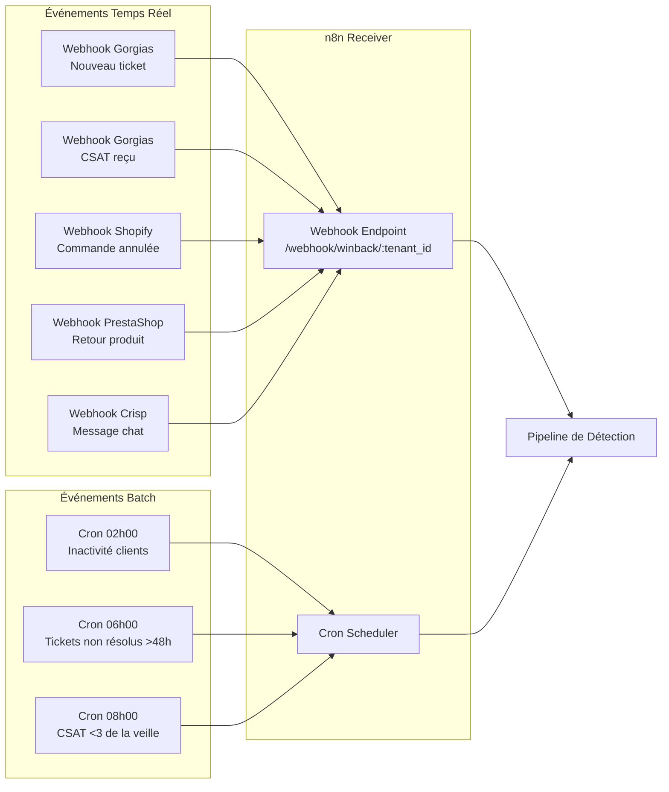
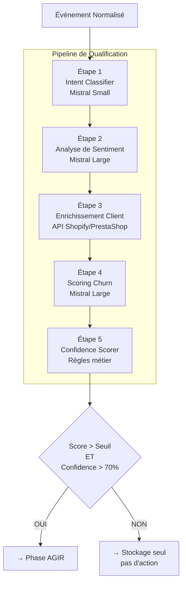
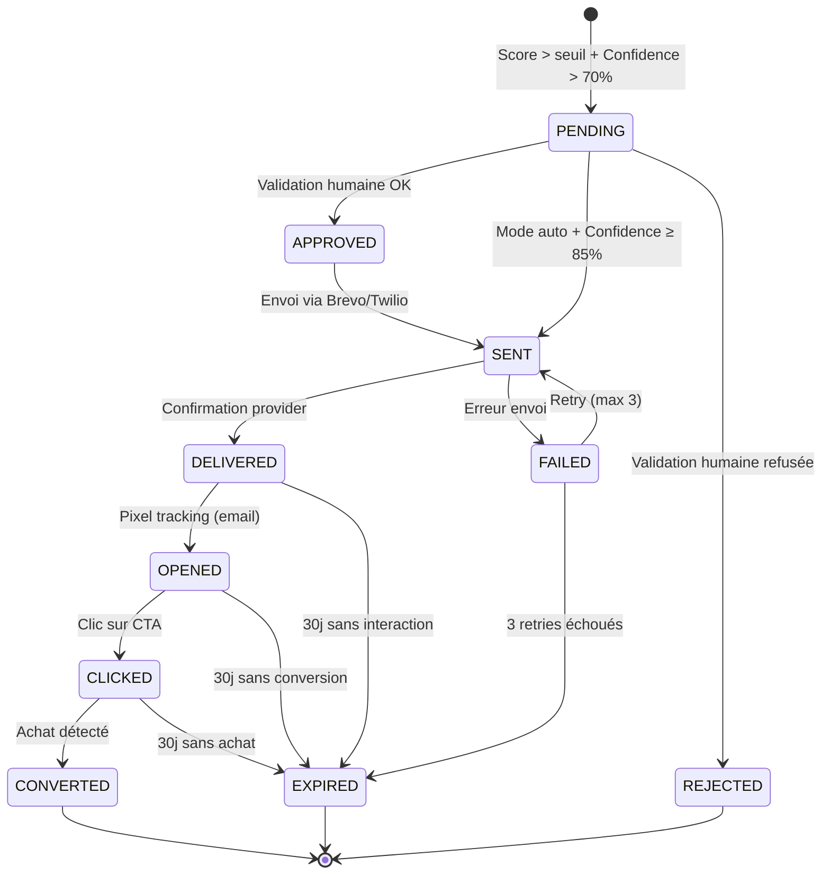
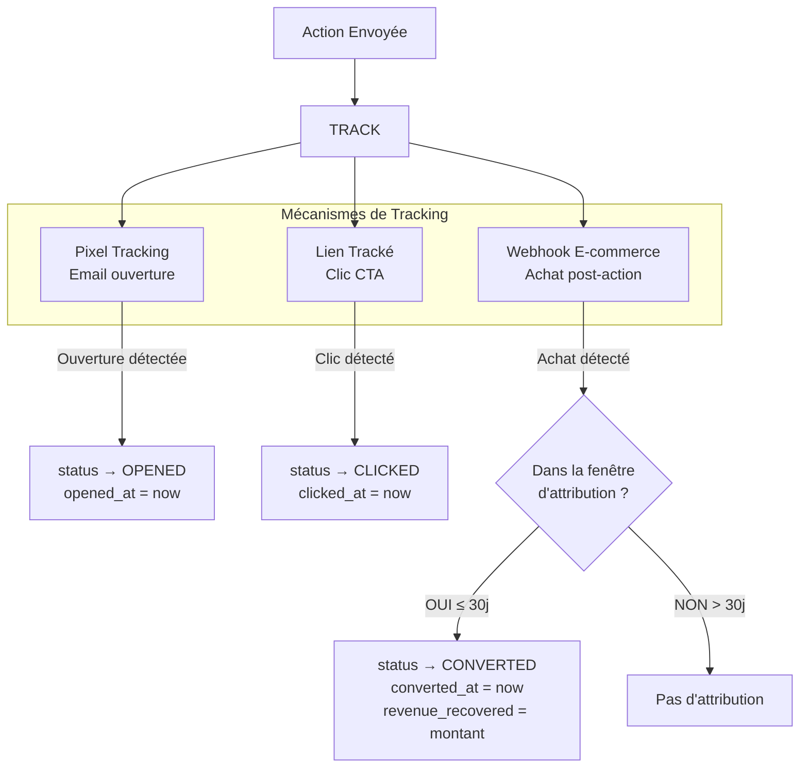

# Flux Agentique — WinBack Agent

> **Statut** : ✅ Validé
> **Priorité** : P1
> **Version** : 1.0
> **Dernière MAJ** : 2026-02-26
> **Dépend de** : `architecture-globale.md`, `modele-donnees.md`, `stack-technique.md`

---

## 1. Objectif

Ce document spécifie le comportement agentique de WinBack Agent : la boucle autonome complète, les machines à états, les arbres de décision, les prompts IA, les mécanismes de retry/fallback, et les garde-fous. Il décrit comment le système **pense, décide et agit** de manière autonome après configuration initiale par le tenant.

---

## 2. Boucle Agentique Principale

WinBack Agent exécute une boucle continue en 4 phases :

```
┌──────────────────────────────────────────────────────────────┐
│                                                              │
│   ┌──────────┐    ┌──────────┐    ┌──────┐    ┌──────────┐  │
│   │ DÉTECTER │───▶│ QUALIFIER│───▶│ AGIR │───▶│ MESURER  │  │
│   └──────────┘    └──────────┘    └──────┘    └──────────┘  │
│        ▲                                           │         │
│        └───────────────────────────────────────────┘         │
│                    Feedback Loop                             │
└──────────────────────────────────────────────────────────────┘
```

| Phase | Rôle | Temps d'exécution | Modules impliqués |
|-------|------|-------------------|-------------------|
| **DÉTECTER** | Identifier un signal d'insatisfaction | < 1s (webhook) | Connecteurs, Intent Classifier |
| **QUALIFIER** | Évaluer le risque et la valeur du client | < 5s | Sentiment Analysis, Churn Scoring, Confidence |
| **AGIR** | Générer et envoyer une action de récupération | < 10s | RAG, Message Generation, Envoi |
| **MESURER** | Tracker le résultat et calculer le ROI | Continu (30j) | Tracking, Attribution, Dashboard |

---

## 3. Phase 1 — DÉTECTER

### 3.1 Sources d'Événements



### 3.2 Événements Déclencheurs

| Événement | Source | Priorité | Délai de traitement |
|-----------|--------|----------|---------------------|
| `ticket.created` | Gorgias, Zendesk, Crisp | Temps réel | < 30s après réception |
| `ticket.updated` (escalade) | Gorgias, Zendesk | Temps réel | < 30s |
| `csat.received` (score ≤ 2/5) | Gorgias | Temps réel | < 30s |
| `order.cancelled` | Shopify, PrestaShop | Temps réel | < 60s |
| `order.refunded` | Shopify, PrestaShop | Temps réel | < 60s |
| `return.created` | Shopify, PrestaShop | Temps réel | < 60s |
| `customer.inactive` | Interne (cron) | Batch quotidien | Traitement nocturne |
| `ticket.unresolved_48h` | Interne (cron) | Batch quotidien | Traitement nocturne |

### 3.3 Validation du Webhook

Chaque webhook reçu passe par une validation en 4 étapes :

```
Étape 1 — Authentification
  → Vérifier la signature HMAC du webhook (secret par intégration)
  → Si invalide → LOG erreur + REJETER

Étape 2 — Identification Tenant
  → Extraire tenant_id depuis l'URL ou le payload
  → Vérifier que le tenant est actif (is_active = true)
  → Vérifier que l'intégration source est active (status = 'ACTIVE')
  → Si inactif → LOG + IGNORER

Étape 3 — Déduplication
  → Vérifier que l'événement n'a pas déjà été traité
  → Clé de déduplication : {tenant_id}:{platform}:{event_id}
  → Cache en mémoire n8n (TTL 1h)
  → Si doublon → IGNORER silencieusement

Étape 4 — Quota Check
  → Vérifier usage_counters du tenant pour la période en cours
  → Si quotas dépassés (actions/mois) → LOG + IGNORER + notifier tenant
  → Si quota > 90% → notifier tenant (alerte préventive)
```

### 3.4 Normalisation des Données

Les événements de sources différentes sont normalisés dans un format unifié :

```typescript
interface NormalizedEvent {
  // Identification
  eventId: string;           // ID unique de l'événement
  tenantId: string;          // Tenant concerné
  platform: Platform;        // Source (GORGIAS, SHOPIFY, etc.)
  eventType: EventType;      // Type normalisé

  // Client
  customer: {
    externalId: string;      // ID sur la plateforme source
    email?: string;
    firstName?: string;
    lastName?: string;
  };

  // Contenu
  content: {
    subject?: string;        // Objet du ticket/message
    body: string;            // Contenu textuel
    language: string;        // Langue détectée (défaut: 'fr')
  };

  // Contexte
  context: {
    csatScore?: number;      // Score CSAT si disponible (1-5)
    orderValue?: number;     // Valeur commande concernée
    ticketPriority?: string; // Priorité ticket source
    isRepeatIssue: boolean;  // Le client a déjà contacté pour ça
  };

  // Métadonnées
  receivedAt: Date;
  rawPayload: object;        // Payload original (debug)
}

type EventType =
  | 'NEW_TICKET'
  | 'TICKET_ESCALATION'
  | 'LOW_CSAT'
  | 'ORDER_CANCELLED'
  | 'ORDER_REFUNDED'
  | 'RETURN_CREATED'
  | 'CUSTOMER_INACTIVE'
  | 'TICKET_UNRESOLVED';
```

---

## 4. Phase 2 — QUALIFIER

### 4.1 Pipeline de Qualification

La qualification est un pipeline séquentiel de 5 étapes. Chaque étape enrichit l'événement normalisé.



### 4.2 Étape 1 — Intent Classifier

**Objectif :** Catégoriser rapidement l'événement pour savoir s'il mérite une analyse approfondie.

**Modèle :** Mistral Small (`mistral-small-latest` — rapide, peu coûteux)

**Prompt Template :**

```
<system>
Tu es un classificateur d'intentions pour un service client e-commerce français.
Classifie le message suivant dans UNE des catégories ci-dessous.
Réponds UNIQUEMENT avec le JSON demandé, sans texte additionnel.
</system>

<user>
Message du client :
"""
{{content.body}}
"""

Contexte :
- Objet : {{content.subject}}
- Type d'événement : {{eventType}}
- CSAT reçu : {{context.csatScore || 'N/A'}}

Catégories possibles :
- COMPLAINT : Réclamation, plainte, insatisfaction
- QUESTION : Question sur un produit, une commande, une politique
- FEEDBACK_NEGATIVE : Retour négatif, déception, frustration
- FEEDBACK_POSITIVE : Retour positif, remerciement, satisfaction
- CANCELLATION : Demande d'annulation, résiliation
- RETURN_REQUEST : Demande de retour, remboursement
- URGENT : Problème grave, menace de quitter, avis négatif public
- OTHER : Autre (hors périmètre)

Réponds en JSON :
{
  "intent": "CATEGORY",
  "confidence": 0.0-1.0,
  "requires_analysis": true/false
}
</user>
```

**Règles de routage post-classification :**

| Intent | `requires_analysis` | Action |
|--------|---------------------|--------|
| COMPLAINT | `true` | → Continuer pipeline |
| FEEDBACK_NEGATIVE | `true` | → Continuer pipeline |
| CANCELLATION | `true` | → Continuer pipeline (haute priorité) |
| RETURN_REQUEST | `true` | → Continuer pipeline |
| URGENT | `true` | → Continuer pipeline (priorité maximale) |
| QUESTION | `false` | → Stocker, pas d'analyse churn |
| FEEDBACK_POSITIVE | `false` | → Stocker, mettre à jour sentiment positif |
| OTHER | `false` | → Ignorer |

**Latence cible :** < 800ms

---

### 4.3 Étape 2 — Analyse de Sentiment

**Objectif :** Évaluer précisément l'état émotionnel du client.

**Modèle :** Mistral Large (`mistral-large-latest` — nuances, ironie, contexte culturel français)

**Prompt Template :**

```
<system>
Tu es un expert en analyse de sentiment pour le service client e-commerce en France.
Tu détectes les nuances émotionnelles : frustration passive, ironie, sarcasme, résignation,
colère, déception, impatience, sentiment d'injustice.

Tu es particulièrement attentif au contexte culturel français :
- Le vouvoiement poli peut masquer une forte insatisfaction
- "Je suis un peu déçu" en français signifie souvent une forte déception
- Les formules de politesse n'atténuent pas le fond du message
- L'ironie et le sarcasme sont fréquents dans les plaintes françaises

Réponds UNIQUEMENT avec le JSON demandé.
</system>

<user>
Message à analyser :
"""
{{content.body}}
"""

Contexte additionnel :
- Intent classifié : {{step1.intent}}
- Événement : {{eventType}}
- Score CSAT (si disponible) : {{context.csatScore || 'N/A'}}
- Le client est un récidiviste (tickets multiples) : {{context.isRepeatIssue}}

Analyse le sentiment et réponds en JSON :
{
  "sentiment_score": -1.0 à +1.0,
  "sentiment_label": "very_negative|negative|slightly_negative|neutral|positive",
  "emotions_detected": ["frustration", "disappointment", ...],
  "intensity": "low|medium|high|critical",
  "irony_detected": true/false,
  "escalation_risk": "low|medium|high|critical",
  "key_phrases": ["phrase révélatrice 1", "phrase révélatrice 2"],
  "confidence": 0.0-1.0
}
</user>
```

**Mapping Sentiment → Score de base :**

| Sentiment Score | Contribution au Churn Score |
|----------------|----------------------------|
| -1.0 à -0.8 | +30 (max contribution) |
| -0.8 à -0.5 | +20 à +29 |
| -0.5 à -0.2 | +10 à +19 |
| -0.2 à +0.2 | +0 à +9 |
| +0.2 à +1.0 | 0 (pas de risque) |

**Latence cible :** < 2s

---

### 4.4 Étape 3 — Enrichissement Client

**Objectif :** Récupérer le profil complet du client depuis les plateformes e-commerce.

**Source :** API Shopify / PrestaShop (selon l'intégration du tenant)

**Données récupérées :**

```typescript
interface CustomerEnrichment {
  // Données e-commerce
  totalOrders: number;
  totalSpent: number;            // LTV brute
  avgOrderValue: number;
  firstOrderDate: Date;
  lastOrderDate: Date;
  daysSinceLastOrder: number;

  // Données tickets (Gorgias/helpdesk)
  totalTickets90d: number;       // Tickets sur 90 jours
  openTickets: number;
  avgResolutionTimeHours: number;
  previousSentiments: number[];  // Scores sentiment des tickets précédents

  // Calculé
  ltvCalculated: number;         // LTV avec projection
  customerAgeMonths: number;
  purchaseFrequency: number;     // Commandes par mois
  isHighValue: boolean;          // Top 20% LTV du tenant
  isAtRisk: boolean;             // Inactivité > 2x fréquence habituelle
}
```

**Logique de cache :**

```
SI enrichissement < 6h pour ce customer
  → Utiliser le cache (éviter les appels API redondants)
SINON
  → Appeler les APIs e-commerce et helpdesk
  → Stocker dans customers.metadata (JSONB)
  → Mettre à jour les colonnes calculées (ltv, total_orders, etc.)
```

**Latence cible :** < 2s (avec cache) / < 4s (sans cache)
**Coût API :** 0€ (inclus dans les quotas Shopify/Gorgias)

---

### 4.5 Étape 4 — Scoring Churn

**Objectif :** Calculer un score de risque de churn de 0 à 100.

**Modèle :** Mistral Large (`mistral-large-latest` — raisonnement structuré)

**Méthode :** Scoring hybride — pondération fixe + ajustement IA.

```
Score Churn (0-100) = Score Pondéré de Base × Ajustement IA

Score Pondéré de Base :
  Sentiment (30%) + Réclamations (25%) + LTV (20%) + Résolution (15%) + Ancienneté (10%)

Ajustement IA : facteur 0.8 à 1.2 basé sur le raisonnement contextuel
```

**Prompt Template :**

```
<system>
Tu es un expert en prédiction de churn pour l'e-commerce français.
Tu reçois un score de churn calculé algorithmiquement et le contexte complet du client.
Ton rôle est d'ajuster ce score en fonction de facteurs contextuels que l'algorithme
ne peut pas capturer.

Facteurs d'ajustement possibles :
- Le message mentionne un concurrent → augmenter le score
- Le client menace de partir publiquement (avis Google, réseaux sociaux) → augmenter
- Le client est fidèle depuis longtemps et c'est sa première plainte → diminuer légèrement
- Le problème est facilement résolvable (retard livraison ponctuel) → diminuer
- Le client a déjà été récupéré par le passé → augmenter (fatigue)
- Plusieurs problèmes cumulés en peu de temps → augmenter significativement
- Le ton est résigné plutôt que en colère → augmenter (risque de départ silencieux)

Ton ajustement doit être un multiplicateur entre 0.8 et 1.2.
Réponds UNIQUEMENT avec le JSON demandé.
</system>

<user>
Score algorithmique calculé : {{baseScore}}/100

Détail du score :
- Sentiment : {{sentimentContribution}}/30 (score : {{sentimentScore}})
- Réclamations 90j : {{reclamationContribution}}/25 (nombre : {{totalTickets90d}})
- LTV : {{ltvContribution}}/20 (valeur : {{ltv}}€, percentile : {{ltvPercentile}})
- Résolution : {{resolutionContribution}}/15 (délai moyen : {{avgResolutionHours}}h)
- Ancienneté : {{ageContribution}}/10 ({{customerAgeMonths}} mois)

Message du client :
"""
{{content.body}}
"""

Profil client :
- {{totalOrders}} commandes, {{ltv}}€ de CA total
- Client depuis {{customerAgeMonths}} mois
- {{totalTickets90d}} tickets en 90 jours
- Dernière commande il y a {{daysSinceLastOrder}} jours
- Récupéré par le passé : {{recoveryCount}} fois

Analyse et ajuste le score. Réponds en JSON :
{
  "base_score": {{baseScore}},
  "adjustment_factor": 0.8-1.2,
  "adjusted_score": int (0-100),
  "reasoning": "Explication de l'ajustement en 1-2 phrases",
  "risk_factors": ["facteur 1", "facteur 2"],
  "protective_factors": ["facteur protecteur 1"],
  "recommended_urgency": "low|medium|high|critical"
}
</user>
```

**Grille de scoring algorithmique détaillée :**

```
SENTIMENT (30 points max) :
  score -1.0 à -0.8 → 30 pts
  score -0.8 à -0.5 → 22 pts
  score -0.5 à -0.2 → 14 pts
  score -0.2 à  0.0 →  7 pts
  score  0.0 à +1.0 →  0 pts

RÉCLAMATIONS 90 JOURS (25 points max) :
  0 tickets    →  0 pts
  1 ticket     →  8 pts
  2 tickets    → 15 pts
  3 tickets    → 20 pts
  4+ tickets   → 25 pts

VALEUR LTV (20 points max) :
  Top 10%  → 20 pts (client très précieux à conserver)
  Top 20%  → 16 pts
  Top 50%  → 12 pts
  Bottom 50% → 6 pts
  Bottom 20% → 3 pts

DÉLAI DE RÉSOLUTION (15 points max) :
  > 72h      → 15 pts
  48-72h     → 12 pts
  24-48h     →  8 pts
  12-24h     →  4 pts
  < 12h      →  0 pts

ANCIENNETÉ (10 points max) :
  < 3 mois  →  3 pts (nouveau, pas encore fidèle)
  3-6 mois  →  5 pts
  6-12 mois →  7 pts
  12-24 mois → 10 pts (client fidèle, perte plus grave)
  > 24 mois →  8 pts (très fidèle, mais plus résilient)
```

**Latence cible :** < 3s

---

### 4.6 Étape 5 — Confidence Scorer

**Objectif :** Évaluer la fiabilité du score pour éviter les faux positifs.

**Méthode :** Règles métier déterministes (pas d'IA).

```typescript
function calculateConfidence(event: NormalizedEvent, enrichment: CustomerEnrichment, scores: PipelineScores): number {
  let confidence = 1.0;

  // Pénalités de confiance
  if (!event.content.body || event.content.body.length < 20) {
    confidence -= 0.20; // Message trop court pour analyser
  }
  if (event.content.language !== 'fr') {
    confidence -= 0.10; // Analyse optimisée pour le français
  }
  if (enrichment.totalOrders === 0) {
    confidence -= 0.15; // Pas d'historique d'achat
  }
  if (enrichment.totalTickets90d === 0 && event.eventType === 'NEW_TICKET') {
    confidence -= 0.05; // Premier contact, peu de données
  }
  if (scores.intentClassifier.confidence < 0.7) {
    confidence -= 0.15; // Intent classification incertaine
  }
  if (scores.sentimentAnalysis.confidence < 0.7) {
    confidence -= 0.15; // Sentiment analysis incertaine
  }
  if (scores.sentimentAnalysis.irony_detected) {
    confidence -= 0.10; // Ironie détectée = interprétation plus risquée
  }

  // Bonus de confiance
  if (enrichment.totalOrders > 5 && enrichment.totalTickets90d > 0) {
    confidence += 0.05; // Profil riche en données
  }
  if (event.context.csatScore !== undefined) {
    confidence += 0.10; // CSAT explicite = signal fort
  }

  return Math.max(0, Math.min(1, confidence)); // Clamp 0-1
}
```

**Seuil de déclenchement :** `confidence >= 0.70`

| Confidence | Action |
|------------|--------|
| ≥ 0.85 | Action automatique (si mode auto activé) |
| 0.70 — 0.84 | Action automatique OU validation humaine (selon config tenant) |
| 0.50 — 0.69 | Stockage du score, pas d'action. Notification si score > 80 |
| < 0.50 | Score stocké mais marqué "low_confidence", pas d'action ni notification |

---

## 5. Phase 3 — AGIR

### 5.1 Machine à États d'une Action



### 5.2 Sélection du Scénario

Quand une action est déclenchée, le système sélectionne le scénario le plus approprié :

```
1. Récupérer les scénarios actifs du tenant
   → WHERE tenant_id = X AND is_active = true
   → ORDER BY priority DESC

2. Filtrer par score de churn
   → WHERE churn_score BETWEEN churn_score_min AND churn_score_max

3. Filtrer par canal disponible
   → Palier unique CoY : email + SMS (350/mois, 0 en essai) — pas de distinction par palier (ADR-017)
   → Vérifier les quotas restants par canal

4. Si plusieurs scénarios matchent
   → Prendre celui avec la priority la plus haute
   → En cas d'égalité → prendre le moins utilisé (usage_count)

5. Si aucun scénario ne matche
   → Utiliser le scénario par défaut système
   → LOG warning "no_matching_scenario"
```

### 5.3 Sélection du Canal

> Palier unique CoY (ADR-017) — plus de branche par palier. Sélection intelligente du canal pour tout tenant.

```mermaid
graph TB
    START[Action à envoyer] --> CHECK_SMS_QUOTA{Quota SMS<br/>restant ? (0 en essai)}

    CHECK_SMS_QUOTA -->|OUI| BEST_CHANNEL{Score + Historique<br/>client}
    CHECK_SMS_QUOTA -->|NON| EMAIL_FALLBACK[Email — fallback quota SMS atteint]

    BEST_CHANNEL -->|Score > 85 + phone| SMS_CHANNEL[SMS]
    BEST_CHANNEL -->|Score 65-85| EMAIL_CHANNEL[Email personnalisé]
    BEST_CHANNEL -->|Déjà contacté par email| SMS_ALT[SMS (canal alternatif)]
```

### 5.4 Génération du Message de Récupération

**Modèle :** Mistral Large (`mistral-large-latest`)

**Prompt Template — Email :**

```
<system>
Tu es un expert en rétention client pour l'e-commerce français.
Tu rédiges des emails de récupération personnalisés qui utilisent des techniques
de persuasion éthique pour reconquérir des clients insatisfaits.

Règles absolues :
1. TOUJOURS vouvoyer (sauf si le tenant a configuré le tutoiement)
2. Ton : {{scenario.triggers_config.tone}} — JAMAIS agressif ni désespéré
3. Longueur : 150-300 mots pour un email, 60-100 caractères pour un SMS
4. Mentionner le problème spécifique du client (montrer qu'on a compris)
5. La compensation doit sembler généreuse mais pas suspecte
6. Inclure UN SEUL call-to-action clair
7. NE JAMAIS mentionner le mot "churn", "rétention", "algorithme" ou "IA"
8. Terminer par une signature humaine (nom du service client de la marque)
9. Mention obligatoire AI Act : inclure en pied de mail en petits caractères :
   "Ce message a été personnalisé avec l'assistance de notre outil de relation client."

Triggers psychologiques autorisés pour ce client :
{{#each scenario.triggers_config.triggers}}
- {{this.id}} (poids : {{this.weight}})
{{/each}}
</system>

<user>
Client à récupérer :
- Prénom : {{customer.firstName}}
- Commandes totales : {{customer.totalOrders}}
- CA total : {{customer.ltv}}€
- Client depuis : {{customer.customerAgeMonths}} mois
- Score de churn : {{churnScore}}/100

Problème actuel :
- Sujet : {{event.content.subject}}
- Message : """{{event.content.body}}"""
- Émotion détectée : {{sentiment.emotions_detected}}
- Intensité : {{sentiment.intensity}}

Compensation à proposer :
- Type : {{compensation.type}}
- Valeur : {{compensation.value}}% de réduction
- Code : {{compensation.code}}
- Validité : {{compensation.validity_days}} jours

Marque :
- Nom : {{tenant.companyName}}
- Domaine : {{integration.shopDomain}}
- Ton souhaité : {{scenario.triggers_config.tone}}

Génère l'email en JSON :
{
  "subject": "Objet de l'email (max 60 caractères, personnalisé)",
  "body_html": "Corps de l'email en HTML simple (paragraphes, gras, lien CTA)",
  "body_text": "Version texte brut",
  "triggers_applied": [
    {"trigger": "nom_trigger", "phrase": "phrase exacte utilisée"}
  ],
  "persuasion_score": 0-100,
  "tone_check": "Confirmation que le ton respecte la consigne"
}
</user>
```

**Prompt Template — SMS :**

```
<system>
Tu rédiges des SMS de récupération client pour l'e-commerce français.
Règles : max 160 caractères, vouvoiement, 1 lien court, pas de spam.
Mention : "[Pub]" en début de SMS (obligation légale française).
</system>

<user>
Client : {{customer.firstName}}, score churn {{churnScore}}/100.
Problème : {{event.content.subject}}.
Compensation : -{{compensation.value}}% avec le code {{compensation.code}}.
Marque : {{tenant.companyName}}.
Lien : {{ctaUrl}}

Génère le SMS en JSON :
{
  "body": "Texte du SMS (max 160 car.)",
  "triggers_applied": [...],
  "persuasion_score": 0-100
}
</user>
```

### 5.5 Validation des Garde-Fous

Avant chaque envoi, le système vérifie :

```
GARDE-FOU 1 — Anti-harcèlement
  → Un même client ne peut pas recevoir plus de :
    • 1 action par 7 jours (cooldown)
    • 3 actions par 30 jours
    • 6 actions par 90 jours
  → Si limite atteinte → BLOQUER + LOG "cooldown_active"

GARDE-FOU 2 — Opt-out
  → Vérifier que le client n'a pas cliqué "se désinscrire"
  → Vérifier la liste de blocage du tenant
  → Si opt-out → BLOQUER + LOG "customer_opted_out"

GARDE-FOU 3 — Horaires d'envoi
  → Emails : envoi immédiat (pas de restriction horaire)
  → SMS : envoi entre 8h00 et 20h00 (heure française)
  → Si hors horaire SMS → mettre en file d'attente pour le lendemain 9h00

GARDE-FOU 4 — Contenu
  → Vérifier que le message généré ne contient pas :
    • Mots interdits : "churn", "rétention", "algorithme", "intelligence artificielle"
    • Promesses impossibles (remboursement > valeur commande)
    • Compensation > max_value_eur configuré
  → Si violation → regénérer le message (1 retry) → si échec → BLOQUER + alerte

GARDE-FOU 5 — Quota financier
  → Calculer le coût total des compensations envoyées ce mois
  → Si > budget mensuel du tenant (configurable) → BLOQUER + notification

GARDE-FOU 6 — Mention AI Act
  → Vérifier que le message contient la mention obligatoire
  → Si absente → l'ajouter automatiquement avant envoi
```

### 5.6 Envoi et Retry

```
ENVOI :
  1. Sélectionner le provider (Brevo Email / Brevo SMS / Twilio)
  2. Appeler l'API du provider
  3. Si succès → status = 'SENT', enregistrer sent_at
  4. Incrémenter usage_counters (actions_sent, emails_sent ou sms_sent)
  5. LOG dans ai_decision_logs

RETRY (en cas d'échec) :
  Politique : Exponential backoff
  • Tentative 1 : immédiate
  • Tentative 2 : après 5 minutes
  • Tentative 3 : après 30 minutes
  • Après 3 échecs : status = 'FAILED', alerte admin

  Si le provider principal échoue 3 fois :
  • Email : fallback Brevo → Resend
  • SMS : fallback Brevo SMS → Twilio
```

---

## 6. Phase 4 — MESURER

### 6.1 Tracking Post-Envoi



### 6.2 Logique d'Attribution

```typescript
async function checkAttribution(action: RecoveryAction, order: ShopifyOrder): Promise<boolean> {
  // 1. Vérifier que la commande est dans la fenêtre d'attribution
  const daysSinceAction = differenceInDays(order.createdAt, action.sentAt);
  if (daysSinceAction > action.attributionWindowDays) {
    return false;
  }

  // 2. Vérifier que c'est bien le même client
  if (order.customerExternalId !== action.customer.externalId) {
    return false;
  }

  // 3. Vérifier que le client n'avait pas déjà une commande en cours
  //    (exclure les commandes passées AVANT l'action WinBack)
  if (order.createdAt < action.sentAt) {
    return false;
  }

  // 4. Attribution confirmée
  return true;
}

function calculateRevenueRecovered(order: ShopifyOrder, multiplier: number): number {
  // CA direct de la commande
  const directRevenue = order.totalPrice;

  // Multiplicateur achat répété (1.7x - 2.2x selon secteur, ADR-018)
  // Source : benchmarks internes + Fevad 2025
  const projectedRevenue = directRevenue * multiplier;

  return projectedRevenue;
}
```

**Multiplicateurs par secteur (configurable par tenant) :**

| Secteur | Multiplicateur | Source |
|---------|---------------|--------|
| Sport & Outdoor | 2,2x | Inchangé |
| Mode | 1,8x | Estimation interne, non validée |
| Décoration | 1,8x | Estimation interne, non validée |
| Autre (défaut) | 1,7x | Inchangé |

### 6.3 Calcul ROI Dashboard

```
ROI du tenant = CA Récupéré Total / Coût Abonnement WinBack

Où :
  CA Récupéré Total = Σ (revenue_recovered de toutes les actions CONVERTED)

  Taux de récupération = Actions CONVERTED / Actions SENT × 100

  CA moyen par action = CA Récupéré Total / Actions CONVERTED

Objectif benchmark : ROI ≥ 5x pour valider la proposition de valeur
```

### 6.4 Expiration des Actions

Workflow cron quotidien (03h00) :

```sql
-- Marquer comme EXPIRED toutes les actions sans conversion
-- dont la fenêtre d'attribution est dépassée
UPDATE recovery_actions
SET status = 'EXPIRED',
    updated_at = now()
WHERE status IN ('SENT', 'DELIVERED', 'OPENED', 'CLICKED')
  AND sent_at + (attribution_window_days || ' days')::interval < now();
```

---

## 7. Orchestration n8n — Workflow Détaillé

### 7.1 Workflow Principal : `winback-pipeline`

```
┌─────────────────────────────────────────────────────────────────────┐
│ WORKFLOW : winback-pipeline                                         │
│ TRIGGER : Webhook POST /webhook/winback/:tenant_id                  │
│                                                                     │
│ ┌───────────┐   ┌────────────┐   ┌─────────────┐   ┌───────────┐  │
│ │ Validate  │──▶│ Normalize  │──▶│ Check Quota │──▶│ Classify  │  │
│ │ Webhook   │   │ Event      │   │ & Dedup     │   │ Intent    │  │
│ └───────────┘   └────────────┘   └─────────────┘   └─────┬─────┘  │
│                                                           │        │
│                                         requires_analysis = true?  │
│                                              │              │      │
│                                             OUI            NON     │
│                                              │              │      │
│                                              ▼              ▼      │
│                                    ┌──────────────┐  ┌──────────┐  │
│                                    │ Sentiment    │  │ Store &  │  │
│                                    │ Analysis     │  │ Exit     │  │
│                                    └──────┬───────┘  └──────────┘  │
│                                           │                        │
│                                           ▼                        │
│                                    ┌──────────────┐                │
│                                    │ Enrich       │                │
│                                    │ Customer     │                │
│                                    └──────┬───────┘                │
│                                           │                        │
│                                           ▼                        │
│                                    ┌──────────────┐                │
│                                    │ Calculate    │                │
│                                    │ Churn Score  │                │
│                                    └──────┬───────┘                │
│                                           │                        │
│                                           ▼                        │
│                                    ┌──────────────┐                │
│                                    │ Confidence   │                │
│                                    │ Check        │                │
│                                    └──────┬───────┘                │
│                                           │                        │
│                              score > seuil ET confidence > 70% ?   │
│                                    │              │                │
│                                   OUI            NON               │
│                                    │              │                │
│                                    ▼              ▼                │
│                            ┌──────────────┐  ┌──────────┐         │
│                            │ Select       │  │ Store    │         │
│                            │ Scenario     │  │ Score &  │         │
│                            └──────┬───────┘  │ Exit     │         │
│                                   │          └──────────┘         │
│                                   ▼                               │
│                            ┌──────────────┐                       │
│                            │ Check        │                       │
│                            │ Garde-Fous   │                       │
│                            └──────┬───────┘                       │
│                                   │                               │
│                              Tous OK ?                            │
│                            │          │                           │
│                           OUI        NON                          │
│                            │          │                           │
│                            ▼          ▼                           │
│                    ┌──────────┐  ┌──────────┐                    │
│                    │ Generate │  │ Block &  │                    │
│                    │ Message  │  │ Log Why  │                    │
│                    └────┬─────┘  └──────────┘                    │
│                         │                                        │
│                         ▼                                        │
│                 ┌───────────────┐                                 │
│                 │ Validate      │                                 │
│                 │ Content       │                                 │
│                 └───────┬───────┘                                 │
│                         │                                        │
│               Mode validation humaine ?                           │
│                    │          │                                   │
│                   OUI        NON                                  │
│                    │          │                                   │
│                    ▼          ▼                                   │
│            ┌───────────┐  ┌──────┐                               │
│            │ Notify    │  │ Send │                                │
│            │ Tenant    │  │      │                                │
│            └───────────┘  └──┬───┘                               │
│                              │                                   │
│                              ▼                                   │
│                      ┌──────────────┐                            │
│                      │ Log Action   │                            │
│                      │ + Update     │                            │
│                      │ Counters     │                            │
│                      └──────────────┘                            │
│                                                                  │
└─────────────────────────────────────────────────────────────────┘
```

### 7.2 Workflows Secondaires

| Workflow | Trigger | Fréquence | Description |
|----------|---------|-----------|-------------|
| `track-email-events` | Webhook Brevo | Temps réel | MAJ status → OPENED / CLICKED |
| `track-conversions` | Webhook Shopify/PrestaShop `order.created` | Temps réel | Vérifier attribution → CONVERTED |
| `expire-actions` | Cron 03h00 | Quotidien | Marquer les actions expirées |
| `batch-inactive` | Cron 02h00 | Quotidien | Scorer les clients inactifs |
| `sync-customers` | Cron toutes les 6h | 4x/jour | Sync données e-commerce |
| `monthly-report` | Cron 1er du mois 08h00 | Mensuel | Générer rapport PDF |
| `quota-alerts` | Cron toutes les heures | Horaire | Vérifier quotas 90%+ |

---

## 8. Gestion des Erreurs

### 8.1 Stratégie par Type d'Erreur

| Type d'erreur | Exemple | Comportement | Retry |
|---------------|---------|--------------|-------|
| **API IA indisponible** | Mistral 500/503 | Retry avec backoff | 3x puis alerte admin |
| **API IA rate limit** | Mistral 429 | Attendre `Retry-After` | Automatique |
| **API e-commerce down** | Shopify 503 | Reporter l'enrichissement | 3x, intervalle 5min |
| **Provider email error** | Brevo 5xx | Retry puis fallback Resend | 3x puis fallback |
| **Provider SMS error** | Brevo SMS 5xx | Retry puis fallback Twilio | 3x |
| **Webhook invalide** | Signature HMAC incorrecte | Rejeter silencieusement | Non |
| **Score confidence basse** | < 0.50 | Stocker sans agir | Non |
| **Quota dépassé** | actions_sent > limit | Bloquer + notifier | Non |
| **Garde-fou déclenché** | Cooldown actif | Bloquer + log | Non |
| **Contenu invalide** | Mot interdit détecté | Regénérer message | 1x |

### 8.2 Dead Letter Queue

Les événements qui échouent après tous les retries sont stockés dans une file d'attente "dead letter" :

```typescript
interface DeadLetterEntry {
  id: string;
  tenantId: string;
  eventType: string;
  originalPayload: object;
  errorType: string;
  errorMessage: string;
  retryCount: number;
  firstFailedAt: Date;
  lastFailedAt: Date;
  resolvedAt?: Date;
}
```

Un cron quotidien (04h00) retente les éléments de la DLQ. Après 72h sans résolution, une alerte admin est envoyée.

---

## 9. Observabilité et Logs

### 9.1 Niveaux de Logging

| Niveau | Usage | Exemples |
|--------|-------|----------|
| `INFO` | Flux normal | "Score calculé: 78/100, confidence: 0.87" |
| `WARN` | Situation inhabituelle mais gérée | "Quota 90% atteint", "Confidence basse: 0.55" |
| `ERROR` | Erreur récupérable | "Mistral API 503, retry 1/3" |
| `CRITICAL` | Erreur non récupérable | "3 retries échoués, dead letter", "RLS violation" |

### 9.2 Métriques Clés (Dashboard Admin)

| Métrique | Calcul | Alerte si |
|----------|--------|-----------|
| Taux de détection | Events reçus / Events traités | < 95% |
| Taux de qualification | Scores calculés / Events traités | < 90% |
| Taux d'action | Actions envoyées / Scores > seuil | < 80% |
| Taux de récupération | Actions CONVERTED / Actions SENT | < 5% (benchmark) |
| Latence pipeline | Temps total webhook → envoi | > 15s |
| Erreur rate | Erreurs / Total appels | > 5% |

---

## 10. Évolutions V2

| Fonctionnalité | Description | Impact |
|----------------|-------------|--------|
| **A/B Testing** | Tester 2 versions de messages pour optimiser le taux de conversion | Nouveau champ `variant` dans recovery_actions |
| **Scoring adaptatif** | Les poids du scoring s'ajustent selon les résultats réels du tenant | Machine learning léger sur les données de conversion |
| **Multi-langue** | Supporter l'anglais et l'espagnol en plus du français | Détection de langue + prompts multilingues |
| **Prédiction proactive** | Scorer les clients AVANT qu'ils contactent le support (signaux faibles) | Cron d'analyse sur les patterns d'achat |
| **WhatsApp conversationnel** | Réponse interactive via WhatsApp (pas juste un message one-shot) | Intégration WhatsApp Business API + gestion de conversation |

---

## 11. Questions Ouvertes

- [x] **Seuil par défaut** : ~~65 ou 70 ?~~ → **65/100 confirmé.** En beta, les faux positifs servent à entraîner le modèle. Le seuil est configurable par tenant (range 50-90), donc 65 par défaut est un bon compromis sensibilité/précision. Réévaluer après 500 scores en beta. *(Décidé 2026-02-26)*
- [x] **Cooldown client** : ~~7 ou 14 jours ?~~ → **7 jours en V1.** Configurable par tenant (range 3-30 jours). 7j est le standard anti-spam. Tout tenant CoY peut descendre à 3j s'il le souhaite. *(Décidé 2026-02-26)*
- [x] **Compensation automatique** : ~~codes auto ou pré-créés ?~~ → **Les deux.** V1 : le tenant fournit des codes pré-créés (pool de codes dans les settings). V2 (M3+) : génération automatique via API Shopify/PrestaShop. Le mode pré-créé est plus simple et rassure les tenants qui veulent garder le contrôle. *(Décidé 2026-02-26)*
- [x] **Fallback IA** : ~~OpenAI dès V1 ?~~ → **Non.** V2 uniquement. Cf. architecture-globale.md. *(Décidé 2026-02-26)*
- [x] **CSAT post-récupération** : ~~envoyer un CSAT J+7 ?~~ → **Oui, en V1.** Email simple avec score 1-5 étoiles (pas de questionnaire long). Le taux de réponse alimente le dashboard ROI et permet de mesurer l'efficacité réelle des récupérations. Envoi via Brevo, résultat stocké dans `recovery_actions.outcome_data`. *(Décidé 2026-02-26)*

---

## 12. Historique des Changements

| Date | Changement | Auteur |
|------|-----------|--------|
| 2026-02-23 | Création du document — flux agentique complet V1 | CoYia |