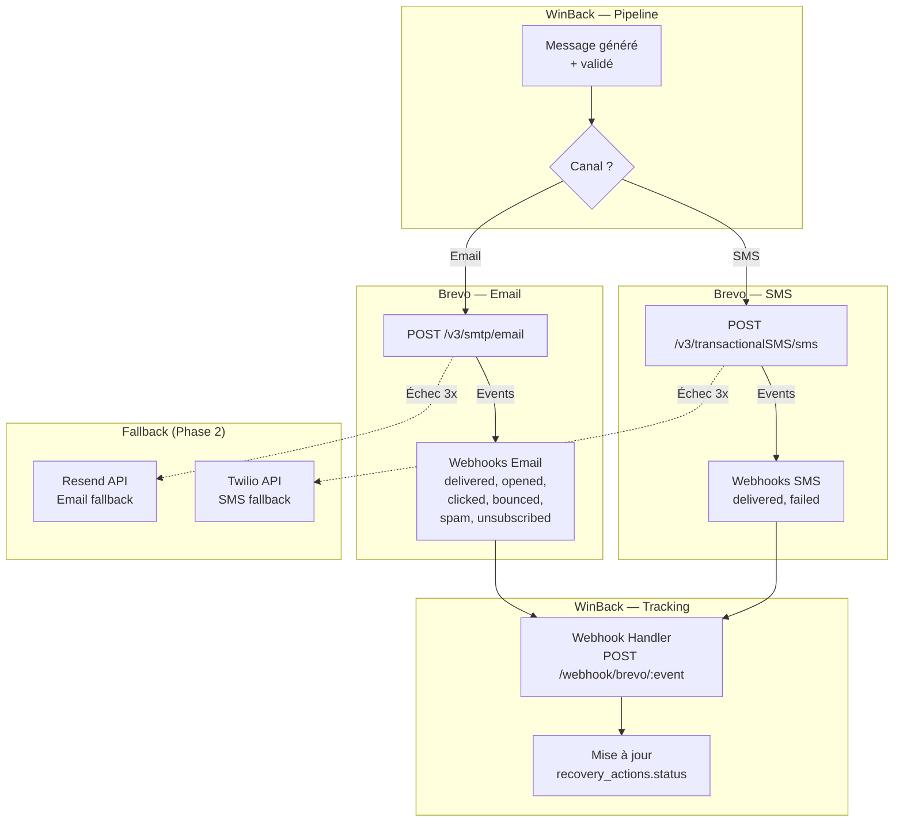

# Intégration : Brevo (Email + SMS)

> **Statut** : ✅ Validé
> **Priorité** : P1 (V1 Beta M5)
> **Version** : 1.0
> **Dernière MAJ** : 2026-02-26
> **Dépend de** : `architecture-globale.md`, `generation-messages.md`, `flux-agentique.md`, `modele-donnees.md`
> **Effort estimé** : 6-8h de développement

---

## 1. Objectif

Brevo (ex-Sendinblue) est le **fournisseur d'envoi principal** de WinBack Agent pour les emails et SMS transactionnels. Brevo est choisi pour son excellent rapport qualité-prix, sa conformité RGPD native (hébergement EU), son support SMS France, et ses webhooks de tracking (ouvertures, clics, bounces). Brevo est l'acteur #1 en France pour l'emailing des PME.

**Rôles de Brevo :**
1. **Envoi d'emails** transactionnels de récupération
2. **Envoi de SMS** de récupération (tout tenant CoY, 0 en essai)
3. **Tracking** des événements post-envoi (opens, clicks, bounces, spam reports)
4. **Gestion des désinscriptions** (opt-out automatique)

---

## 2. User Stories

| ID | En tant que... | Je veux... | Afin de... | Priorité |
|----|---------------|-----------|-----------|----------|
| BR-01 | Système | Envoyer des emails transactionnels via Brevo | Délivrer les messages de récupération aux clients | P1 |
| BR-02 | Système | Envoyer des SMS via Brevo | Toucher les clients sur un canal à fort taux d'ouverture | P1 |
| BR-03 | Système | Recevoir les événements de tracking (open, click, bounce) | Mettre à jour le statut des actions dans le funnel | P1 |
| BR-04 | Système | Gérer les désinscriptions automatiquement | Respecter l'opt-out et éviter le harcèlement | P1 |
| BR-05 | Système | Gérer les bounces (hard/soft) | Maintenir une bonne réputation d'envoi | P1 |
| BR-06 | Système | Suivre les coûts d'envoi par tenant | Imputer les coûts et gérer les quotas | P2 |
| BR-07 | Tenant | Voir le taux de délivrabilité de mes emails | Comprendre la qualité de mes envois | P2 |
| BR-08 | Système | Basculer vers un fournisseur de secours si Brevo est down | Garantir la continuité d'envoi | P2 |

---

## 3. Architecture de l'Intégration



---

## 4. Authentification Brevo

### 4.1 Compte et API Key

WinBack utilise un **compte Brevo unique** (compte de la plateforme WinBack, pas un compte par tenant). Les emails sont envoyés au nom de WinBack avec un expéditeur configurable.

| Élément | Valeur | Stockage |
|---------|--------|----------|
| API Key | Clé API Brevo v3 | Variable d'environnement `BREVO_API_KEY` |
| API Base URL | `https://api.brevo.com/v3` | Hardcoded |
| Sender Email (défaut) | `noreply@winback-agent.fr` | Configurable par tenant |
| Sender Name (défaut) | `{tenant.companyName}` | Automatique |
| SMS Sender | `WinBack` ou `{tenant.companyName}` (11 car. max) | Configurable par tenant |

### 4.2 Pourquoi un Compte Unique

| Option | Avantage | Inconvénient | Choix |
|--------|----------|-------------|-------|
| Compte WinBack unique | Simple, coût maîtrisé, setup instantané | Réputation partagée, personnalisation limitée | ✅ V1 |
| Compte Brevo par tenant | Réputation isolée, domaine custom | Setup complexe, coût par tenant | V2 (tout tenant CoY) |

### 4.3 Configuration de l'Expéditeur

```
Palier CoY (par défaut) :
  From: "{tenant.companyName}" <noreply@winback-agent.fr>
  Reply-To: {tenant.contactEmail}
  Possibilité de custom sender (avec vérification DNS)
  Domaine vérifié (SPF, DKIM, DMARC) et compte Brevo dédié : V2, tout tenant CoY
```

---

## 5. Envoi d'Emails

### 5.1 API Transactionnelle

```typescript
interface BrevoEmailPayload {
  sender: {
    name: string;
    email: string;
  };
  to: Array<{
    email: string;
    name: string;
  }>;
  replyTo?: {
    email: string;
    name: string;
  };
  subject: string;
  htmlContent: string;
  textContent: string;
  headers?: Record<string, string>;
  tags?: string[];
  params?: Record<string, string>;
}

async function sendRecoveryEmail(
  action: RecoveryAction,
  message: GeneratedMessage,
  customer: Customer,
  tenant: Tenant
): Promise<SendResult> {
  const senderConfig = getSenderConfig(tenant);

  const payload: BrevoEmailPayload = {
    sender: {
      name: senderConfig.name,
      email: senderConfig.email,
    },
    to: [{
      email: customer.email,
      name: `${customer.firstName} ${customer.lastName}`.trim(),
    }],
    replyTo: {
      email: tenant.contactEmail,
      name: tenant.companyName,
    },
    subject: message.subject,
    htmlContent: buildFullHtmlEmail(message, tenant, action),
    textContent: message.body_text,
    headers: {
      'X-Winback-Action-Id': action.id,
      'X-Winback-Tenant-Id': tenant.id,
      'List-Unsubscribe': `<https://app.winback-agent.fr/unsubscribe/${hashCustomerId(customer.id)}>`,
      'List-Unsubscribe-Post': 'List-Unsubscribe=One-Click',
    },
    tags: [
      `tenant:${tenant.id}`,
      `action:${action.id}`,
      `score:${action.churnScore}`,
      'winback-recovery',
    ],
  };

  try {
    const response = await fetch('https://api.brevo.com/v3/smtp/email', {
      method: 'POST',
      headers: {
        'api-key': process.env.BREVO_API_KEY,
        'Content-Type': 'application/json',
        'Accept': 'application/json',
      },
      body: JSON.stringify(payload),
    });

    if (!response.ok) {
      const error = await response.json();
      throw new BrevoApiError(response.status, error);
    }

    const result = await response.json();

    return {
      success: true,
      messageId: result.messageId,
      provider: 'BREVO',
    };
  } catch (error) {
    return {
      success: false,
      error: error.message,
      provider: 'BREVO',
    };
  }
}
```

### 5.2 Construction de l'Email HTML Complet

```typescript
function buildFullHtmlEmail(
  message: GeneratedMessage,
  tenant: Tenant,
  action: RecoveryAction
): string {
  // Le body_html généré par Mistral est du HTML simple (<p>, <strong>, <a>)
  // On l'enveloppe dans un template responsive minimal

  return `
<!DOCTYPE html>
<html lang="fr">
<head>
  <meta charset="utf-8">
  <meta name="viewport" content="width=device-width, initial-scale=1.0">
  <title>${escapeHtml(message.subject)}</title>
</head>
<body style="margin: 0; padding: 0; background-color: #f5f5f5; font-family: -apple-system, BlinkMacSystemFont, 'Segoe UI', Roboto, sans-serif;">
  <table role="presentation" width="100%" cellpadding="0" cellspacing="0" style="background-color: #f5f5f5;">
    <tr>
      <td align="center" style="padding: 24px 16px;">
        <table role="presentation" width="600" cellpadding="0" cellspacing="0" style="background-color: #ffffff; border-radius: 8px; max-width: 600px;">

          <!-- CONTENU -->
          <tr>
            <td style="padding: 32px 24px; font-size: 16px; line-height: 1.6; color: #333333;">
              ${message.body_html}
            </td>
          </tr>

          <!-- SIGNATURE -->
          <tr>
            <td style="padding: 0 24px 24px; font-size: 14px; color: #666666;">
              <p style="margin: 0;">
                ${escapeHtml(message.signature_name)}<br>
                <em>${escapeHtml(message.signature_role)}, ${escapeHtml(tenant.companyName)}</em>
              </p>
            </td>
          </tr>

          <!-- SÉPARATEUR -->
          <tr>
            <td style="padding: 0 24px;">
              <hr style="border: none; border-top: 1px solid #eeeeee;">
            </td>
          </tr>

          <!-- FOOTER -->
          <tr>
            <td style="padding: 16px 24px; font-size: 12px; color: #999999; line-height: 1.5;">
              <p style="margin: 0 0 8px;">
                Ce message a été personnalisé avec l'assistance de notre outil de relation client.
              </p>
              <p style="margin: 0;">
                <a href="https://app.winback-agent.fr/unsubscribe/${hashCustomerId(action.customerId)}" style="color: #999999; text-decoration: underline;">
                  Se désinscrire de ces messages
                </a>
              </p>
            </td>
          </tr>

        </table>
      </td>
    </tr>
  </table>

  <!-- PIXEL DE TRACKING (1x1 transparent) -->
  
</body>
</html>`;
}
```

### 5.3 Pixel de Tracking (Ouvertures)

```typescript
// Route : GET /track/open/:actionId
// Retourne une image 1x1 transparente et log l'ouverture

async function handleOpenTracking(actionId: string): Promise<Response> {
  // Mettre à jour le status de l'action
  await db.recoveryActions.updateMany({
    where: {
      id: actionId,
      status: { in: ['SENT', 'DELIVERED'] }, // Ne pas rétrograder un CLICKED
    },
    data: {
      status: 'OPENED',
      openedAt: new Date(),
    },
  });

  // Retourner un pixel transparent 1x1
  const pixel = Buffer.from(
    'R0lGODlhAQABAIAAAAAAAP///yH5BAEAAAAALAAAAAABAAEAAAIBRAA7',
    'base64'
  );

  return new Response(pixel, {
    headers: {
      'Content-Type': 'image/gif',
      'Cache-Control': 'no-store, no-cache, must-revalidate',
    },
  });
}
```

**Note :** Brevo a aussi son propre tracking d'ouvertures. WinBack utilise les **deux** méthodes (pixel custom + webhook Brevo) pour maximiser la fiabilité. Le premier événement reçu met à jour le statut.

### 5.4 Liens de Tracking (Clics)

```typescript
// Route : GET /track/click/:actionId
// Redirect vers l'URL de destination et log le clic

async function handleClickTracking(actionId: string): Promise<Response> {
  const action = await db.recoveryActions.findUnique({
    where: { id: actionId },
    include: { scenario: true },
  });

  if (!action) {
    return Response.redirect('https://winback-agent.fr', 302);
  }

  // Mettre à jour le status
  await db.recoveryActions.update({
    where: { id: actionId },
    data: {
      status: 'CLICKED',
      clickedAt: new Date(),
    },
  });

  // Rediriger vers l'URL de destination (boutique + code promo)
  const destinationUrl = action.ctaUrl || `https://${action.scenario.config.shopDomain}`;
  return Response.redirect(destinationUrl, 302);
}
```

---

## 6. Envoi de SMS

### 6.1 API Transactionnelle SMS

```typescript
interface BrevoSmsPayload {
  type: 'transactional';
  unicodeEnabled: false;
  sender: string;       // Max 11 caractères alphanumériques
  recipient: string;    // Format international +33612345678
  content: string;      // Max 160 caractères GSM-7
  tag?: string;
  webUrl?: string;      // URL pour le callback de statut
}

async function sendRecoverySms(
  action: RecoveryAction,
  message: GeneratedSmsMessage,
  customer: Customer,
  tenant: Tenant
): Promise<SendResult> {
  // Vérifier que le client a un numéro de téléphone valide
  if (!customer.phone) {
    return { success: false, error: 'Pas de numéro de téléphone', provider: 'BREVO' };
  }

  const phoneFormatted = formatPhoneInternational(customer.phone);
  if (!phoneFormatted) {
    return { success: false, error: 'Numéro de téléphone invalide', provider: 'BREVO' };
  }

  // Vérifier les horaires légaux (8h-20h France)
  if (!isWithinSmsHours()) {
    // Mettre en file d'attente pour envoi à 8h00
    await queueSmsForLater(action, message, customer, tenant);
    return { success: true, queued: true, provider: 'BREVO' };
  }

  // Construire le SMS complet
  const trackingLink = `https://wb.link/${generateShortId(action.id)}`;
  const fullSms = `[Pub] ${message.body} ${trackingLink} STOP au 36200`;

  // Vérifier la longueur
  if (fullSms.length > 160) {
    logger.warn(`SMS too long (${fullSms.length} chars), truncating body`);
    const maxBodyLength = 160 - 6 - 1 - trackingLink.length - 1 - 15; // [Pub] + space + link + space + STOP
    const truncatedBody = message.body.substring(0, maxBodyLength - 3) + '...';
    const truncatedSms = `[Pub] ${truncatedBody} ${trackingLink} STOP au 36200`;
    if (truncatedSms.length > 160) {
      return { success: false, error: 'SMS impossible à formater en 160 caractères', provider: 'BREVO' };
    }
  }

  // Sender name (max 11 car. alphanumériques)
  const senderName = sanitizeSmsSender(tenant.companyName);

  const payload: BrevoSmsPayload = {
    type: 'transactional',
    unicodeEnabled: false,
    sender: senderName,
    recipient: phoneFormatted,
    content: fullSms,
    tag: `winback-${action.id}`,
    webUrl: `https://n8n.winback-agent.fr/webhook/brevo/sms-status`,
  };

  try {
    const response = await fetch('https://api.brevo.com/v3/transactionalSMS/sms', {
      method: 'POST',
      headers: {
        'api-key': process.env.BREVO_API_KEY,
        'Content-Type': 'application/json',
      },
      body: JSON.stringify(payload),
    });

    if (!response.ok) {
      const error = await response.json();
      throw new BrevoApiError(response.status, error);
    }

    const result = await response.json();

    return {
      success: true,
      messageId: result.reference,
      provider: 'BREVO',
    };
  } catch (error) {
    return {
      success: false,
      error: error.message,
      provider: 'BREVO',
    };
  }
}
```

### 6.2 Formatage du Numéro de Téléphone

```typescript
function formatPhoneInternational(phone: string): string | null {
  // Nettoyer
  let clean = phone.replace(/[\s\-\.\(\)]/g, '');

  // France : 06/07 → +336/+337
  if (clean.startsWith('06') || clean.startsWith('07')) {
    clean = '+33' + clean.substring(1);
  }
  if (clean.startsWith('0033')) {
    clean = '+33' + clean.substring(4);
  }

  // Validation basique : +33 suivi de 9 chiffres
  if (/^\+33[67]\d{8}$/.test(clean)) {
    return clean;
  }

  // Autres formats internationaux (V2 : support multi-pays)
  if (/^\+\d{10,15}$/.test(clean)) {
    return clean;
  }

  return null; // Numéro invalide
}

function sanitizeSmsSender(companyName: string): string {
  // Max 11 caractères alphanumériques, pas que des chiffres
  let sender = companyName
    .replace(/[^a-zA-Z0-9]/g, '') // Supprimer les caractères spéciaux
    .substring(0, 11);

  // Si vide ou que des chiffres → fallback
  if (!sender || /^\d+$/.test(sender)) {
    sender = 'WinBack';
  }

  return sender;
}
```

### 6.3 Gestion des Horaires Légaux (SMS)

```typescript
function isWithinSmsHours(): boolean {
  // Réglementation française : SMS commerciaux uniquement entre 8h et 20h
  // Pas le dimanche ni les jours fériés
  const now = new Date();
  const parisTime = new Intl.DateTimeFormat('fr-FR', {
    timeZone: 'Europe/Paris',
    hour: 'numeric',
    minute: 'numeric',
  }).formatToParts(now);

  const hour = parseInt(parisTime.find(p => p.type === 'hour')?.value || '0');
  const dayOfWeek = new Date().toLocaleDateString('fr-FR', {
    timeZone: 'Europe/Paris',
    weekday: 'long',
  });

  // Dimanche interdit
  if (dayOfWeek === 'dimanche') return false;

  // Jours fériés (liste simplifiée, à compléter)
  if (isFrenchPublicHoliday(now)) return false;

  // Horaires : 8h-20h
  return hour >= 8 && hour < 20;
}

async function queueSmsForLater(
  action: RecoveryAction,
  message: GeneratedSmsMessage,
  customer: Customer,
  tenant: Tenant
): Promise<void> {
  // Calculer le prochain créneau autorisé
  const nextWindow = getNextSmsWindow(); // Prochain jour ouvré à 8h00

  await db.smsQueue.create({
    data: {
      actionId: action.id,
      customerId: customer.id,
      tenantId: tenant.id,
      messageBody: message.body,
      scheduledAt: nextWindow,
      status: 'QUEUED',
    },
  });

  logger.info(`SMS queued for ${nextWindow.toISOString()} (outside SMS hours)`);
}

// Cron toutes les 5 minutes pendant les heures autorisées
async function processSmsQueue(): Promise<void> {
  if (!isWithinSmsHours()) return;

  const pendingSms = await db.smsQueue.findMany({
    where: {
      status: 'QUEUED',
      scheduledAt: { lte: new Date() },
    },
    take: 20, // Batch de 20
    orderBy: { scheduledAt: 'asc' },
  });

  for (const sms of pendingSms) {
    // Envoyer le SMS
    const result = await sendRecoverySms(/* ... */);

    await db.smsQueue.update({
      where: { id: sms.id },
      data: {
        status: result.success ? 'SENT' : 'FAILED',
        sentAt: result.success ? new Date() : undefined,
        error: result.error,
      },
    });
  }
}
```

---

## 7. Webhooks Brevo (Tracking)

### 7.1 Configuration des Webhooks

Configurer dans Brevo Dashboard → Settings → Webhooks, ou via l'API :

```typescript
async function setupBrevoWebhooks(): Promise<void> {
  const webhooks = [
    // Email events
    { url: `${WEBHOOK_BASE}/brevo/email-delivered`, events: ['delivered'], type: 'transactional' },
    { url: `${WEBHOOK_BASE}/brevo/email-opened`, events: ['opened'], type: 'transactional' },
    { url: `${WEBHOOK_BASE}/brevo/email-clicked`, events: ['click'], type: 'transactional' },
    { url: `${WEBHOOK_BASE}/brevo/email-bounced`, events: ['hardBounce', 'softBounce'], type: 'transactional' },
    { url: `${WEBHOOK_BASE}/brevo/email-spam`, events: ['spam'], type: 'transactional' },
    { url: `${WEBHOOK_BASE}/brevo/email-unsubscribed`, events: ['unsubscribed'], type: 'transactional' },
    // SMS events
    { url: `${WEBHOOK_BASE}/brevo/sms-status`, events: ['delivered', 'failed'], type: 'transactional' },
  ];

  for (const wh of webhooks) {
    await fetch('https://api.brevo.com/v3/webhooks', {
      method: 'POST',
      headers: {
        'api-key': process.env.BREVO_API_KEY,
        'Content-Type': 'application/json',
      },
      body: JSON.stringify({
        url: wh.url,
        events: wh.events,
        type: wh.type,
      }),
    });
  }
}
```

### 7.2 Payloads des Webhooks Email

**Delivered :**
```json
{
  "event": "delivered",
  "email": "marie.dupont@email.com",
  "message-id": "<202602231423.abc123@smtp-relay.brevo.com>",
  "date": "2026-02-23T14:23:50.000Z",
  "tags": ["winback-recovery", "tenant:xxx", "action:yyy"],
  "subject": "Marie, nous tenons à nous excuser"
}
```

**Opened :**
```json
{
  "event": "opened",
  "email": "marie.dupont@email.com",
  "message-id": "<202602231423.abc123@smtp-relay.brevo.com>",
  "date": "2026-02-23T16:45:00.000Z",
  "tags": ["winback-recovery", "action:yyy"],
  "ip": "92.184.xxx.xxx"
}
```

**Clicked :**
```json
{
  "event": "click",
  "email": "marie.dupont@email.com",
  "message-id": "<202602231423.abc123@smtp-relay.brevo.com>",
  "date": "2026-02-23T17:02:00.000Z",
  "link": "https://wb.link/x3k9m",
  "tags": ["action:yyy"]
}
```

**Hard Bounce :**
```json
{
  "event": "hardBounce",
  "email": "ancien.email@domaine-mort.fr",
  "message-id": "<...>",
  "date": "2026-02-23T14:24:00.000Z",
  "reason": "User unknown"
}
```

### 7.3 Handler des Webhooks

```typescript
async function handleBrevoEmailWebhook(
  event: BrevoEmailEvent
): Promise<void> {
  // Extraire l'actionId des tags
  const actionTag = event.tags?.find(t => t.startsWith('action:'));
  if (!actionTag) {
    logger.debug('Brevo webhook without action tag, ignoring');
    return;
  }
  const actionId = actionTag.replace('action:', '');

  const action = await db.recoveryActions.findUnique({
    where: { id: actionId },
  });
  if (!action) return;

  switch (event.event) {
    case 'delivered':
      await updateActionStatus(action, 'DELIVERED', { deliveredAt: new Date(event.date) });
      break;

    case 'opened':
      // Ne pas rétrograder un CLICKED ou CONVERTED
      if (['SENT', 'DELIVERED'].includes(action.status)) {
        await updateActionStatus(action, 'OPENED', { openedAt: new Date(event.date) });
      }
      break;

    case 'click':
      if (['SENT', 'DELIVERED', 'OPENED'].includes(action.status)) {
        await updateActionStatus(action, 'CLICKED', { clickedAt: new Date(event.date) });
      }
      break;

    case 'hardBounce':
      await handleBounce(action, 'hard', event.reason);
      break;

    case 'softBounce':
      await handleBounce(action, 'soft', event.reason);
      break;

    case 'spam':
      await handleSpamReport(action, event.email);
      break;

    case 'unsubscribed':
      await handleUnsubscribe(action, event.email);
      break;
  }
}

async function updateActionStatus(
  action: RecoveryAction,
  newStatus: ActionStatus,
  timestamps: Partial<RecoveryAction>
): Promise<void> {
  // Ordre hiérarchique : SENT < DELIVERED < OPENED < CLICKED < CONVERTED
  const statusOrder: Record<string, number> = {
    PENDING: 0, APPROVED: 1, SENT: 2, DELIVERED: 3,
    OPENED: 4, CLICKED: 5, CONVERTED: 6,
    FAILED: -1, REJECTED: -2, EXPIRED: -3,
  };

  // Ne jamais rétrograder le statut
  if ((statusOrder[newStatus] || 0) <= (statusOrder[action.status] || 0)) {
    return;
  }

  await db.recoveryActions.update({
    where: { id: action.id },
    data: {
      status: newStatus,
      ...timestamps,
    },
  });
}
```

### 7.4 Gestion des Bounces

```typescript
async function handleBounce(
  action: RecoveryAction,
  bounceType: 'hard' | 'soft',
  reason: string
): Promise<void> {
  if (bounceType === 'hard') {
    // Hard bounce → email invalide, ne plus jamais envoyer
    await db.recoveryActions.update({
      where: { id: action.id },
      data: {
        status: 'FAILED',
        errorMessage: `Hard bounce: ${reason}`,
      },
    });

    // Marquer le client comme non-joignable par email
    await db.customers.update({
      where: { id: action.customerId },
      data: {
        emailBounced: true,
        updatedAt: new Date(),
      },
    });

    logger.warn(`Hard bounce for customer ${action.customerId}: ${reason}`);

  } else {
    // Soft bounce → problème temporaire, retry possible
    const retryCount = action.retryCount || 0;

    if (retryCount < 2) {
      // Retry dans 30 minutes
      await db.recoveryActions.update({
        where: { id: action.id },
        data: {
          retryCount: retryCount + 1,
          nextRetryAt: addMinutes(new Date(), 30),
          errorMessage: `Soft bounce (attempt ${retryCount + 1}): ${reason}`,
        },
      });
    } else {
      // 3ème soft bounce → marquer comme FAILED
      await db.recoveryActions.update({
        where: { id: action.id },
        data: {
          status: 'FAILED',
          errorMessage: `Soft bounce x3: ${reason}`,
        },
      });
    }
  }
}
```

### 7.5 Gestion des Spam Reports

```typescript
async function handleSpamReport(
  action: RecoveryAction,
  email: string
): Promise<void> {
  // Le client a marqué l'email comme spam → GRAVE
  // 1. Marquer l'action comme FAILED
  await db.recoveryActions.update({
    where: { id: action.id },
    data: {
      status: 'FAILED',
      errorMessage: 'Marked as spam by recipient',
    },
  });

  // 2. Ajouter le client à la blacklist du tenant
  await addToBlocklist(action.tenantId, action.customerId, 'SPAM_REPORT');

  // 3. Log critique — les spam reports impactent la réputation d'envoi
  logger.error(`SPAM REPORT: tenant ${action.tenantId}, customer ${action.customerId}, email ${email}`);

  // 4. Si le tenant accumule trop de spam reports → alerte
  const spamCount30d = await countSpamReports(action.tenantId, 30);
  if (spamCount30d >= 5) {
    await alertTenantSpamIssue(action.tenantId, spamCount30d);
  }
}
```

### 7.6 Gestion des Désinscriptions

```typescript
async function handleUnsubscribe(
  action: RecoveryAction,
  email: string
): Promise<void> {
  // 1. Marquer l'action
  await db.recoveryActions.update({
    where: { id: action.id },
    data: {
      errorMessage: 'Recipient unsubscribed',
    },
  });

  // 2. Ajouter à la blacklist (opt-out)
  await addToBlocklist(action.tenantId, action.customerId, 'UNSUBSCRIBE');

  // 3. Le client ne recevra plus jamais de messages WinBack pour ce tenant
  logger.info(`Unsubscribe: tenant ${action.tenantId}, customer ${action.customerId}`);
}

async function addToBlocklist(
  tenantId: string,
  customerId: string,
  reason: 'SPAM_REPORT' | 'UNSUBSCRIBE' | 'HARD_BOUNCE' | 'MANUAL'
): Promise<void> {
  await db.blocklist.upsert({
    where: {
      tenantId_customerId: { tenantId, customerId },
    },
    create: {
      tenantId,
      customerId,
      reason,
      createdAt: new Date(),
    },
    update: {
      reason,
      updatedAt: new Date(),
    },
  });
}
```

---

## 8. Webhooks SMS

### 8.1 Payload Webhook SMS

```json
{
  "reference": "sms-abc123",
  "phoneNumber": "+33612345678",
  "status": "delivered",
  "date": "2026-02-23T14:25:00.000Z",
  "tag": "winback-action-yyy"
}
```

**Status possibles :** `delivered`, `softFail`, `hardFail`, `sending`

```typescript
async function handleBrevoSmsWebhook(event: BrevoSmsEvent): Promise<void> {
  const actionId = extractActionIdFromTag(event.tag);
  if (!actionId) return;

  const action = await db.recoveryActions.findUnique({ where: { id: actionId } });
  if (!action) return;

  switch (event.status) {
    case 'delivered':
      await updateActionStatus(action, 'DELIVERED', { deliveredAt: new Date(event.date) });
      break;

    case 'softFail':
      // Numéro temporairement indisponible → retry
      await handleSmsSoftFail(action);
      break;

    case 'hardFail':
      // Numéro invalide → ne plus envoyer de SMS
      await db.recoveryActions.update({
        where: { id: action.id },
        data: {
          status: 'FAILED',
          errorMessage: 'SMS hard fail - numéro invalide',
        },
      });
      break;
  }
}
```

---

## 9. Lien Court (URL Shortener)

### 9.1 Service de Liens Courts

WinBack utilise un raccourcisseur d'URLs interne pour les liens dans les SMS et pour le tracking des clics email.

```typescript
// Domaine : wb.link (ou sous-domaine de winback-agent.fr)
// Format : https://wb.link/{shortId}
// shortId = 5 caractères alphanumériques (base62)

async function createShortLink(
  actionId: string,
  destinationUrl: string
): Promise<string> {
  const shortId = generateShortId(); // 5 char base62 → 916M combinaisons

  await db.shortLinks.create({
    data: {
      shortId,
      actionId,
      destinationUrl,
      createdAt: new Date(),
    },
  });

  return `https://wb.link/${shortId}`;
}

// Route : GET https://wb.link/:shortId
async function handleShortLinkRedirect(shortId: string): Promise<Response> {
  const link = await db.shortLinks.findUnique({ where: { shortId } });

  if (!link) {
    return Response.redirect('https://winback-agent.fr', 302);
  }

  // Log le clic
  if (link.actionId) {
    await db.recoveryActions.update({
      where: { id: link.actionId },
      data: {
        status: 'CLICKED',
        clickedAt: new Date(),
      },
    });
  }

  // Ajouter les UTM
  const url = new URL(link.destinationUrl);
  url.searchParams.set('utm_source', 'winback');
  url.searchParams.set('utm_medium', 'sms');
  url.searchParams.set('utm_campaign', 'recovery');
  url.searchParams.set('utm_content', link.actionId || '');

  return Response.redirect(url.toString(), 302);
}

function generateShortId(): string {
  const chars = 'abcdefghijklmnopqrstuvwxyzABCDEFGHIJKLMNOPQRSTUVWXYZ0123456789';
  return Array.from({ length: 5 }, () =>
    chars[Math.floor(Math.random() * chars.length)]
  ).join('');
}
```

---

## 10. Délivrabilité

### 10.1 Bonnes Pratiques Email

| Règle | Application | Impact |
|-------|-------------|--------|
| SPF/DKIM/DMARC | Configuré sur le domaine winback-agent.fr | Authentification email |
| List-Unsubscribe header | Présent dans chaque email | Exigé par Gmail/Yahoo (2024+) |
| One-Click Unsubscribe | `List-Unsubscribe-Post` header | Standard RFC 8058 |
| Pas d'images externes | Template HTML minimal, pas d'images | Éviter les filtres anti-spam |
| Ratio texte/HTML | 60%+ de texte dans le HTML | Score de spam réduit |
| Pas de mots spam | "GRATUIT", "PROMO", "URGENT" évités | Filtres bayésiens |
| Volume progressif | Montée en charge graduelle par IP | Warming de la réputation |
| Bounce handling | Hard bounces → blacklist immédiate | Réputation protégée |

### 10.2 Métriques de Délivrabilité

| Métrique | Objectif | Alerte si |
|----------|----------|-----------|
| Taux de délivrabilité | > 97% | < 95% |
| Taux d'ouverture | > 30% | < 15% |
| Taux de clic | > 5% | < 2% |
| Taux de bounce | < 3% | > 5% |
| Taux de spam report | < 0.1% | > 0.3% |
| Taux de désinscription | < 2% | > 5% |

### 10.3 Dashboard Délivrabilité (tout tenant CoY)

```
┌──────────────────────────────────────────────────────────────┐
│  Délivrabilité Email — 30 derniers jours                     │
│                                                              │
│  Envoyés: 87  │  Délivrés: 82 (94.3%)  │  Bounces: 5 (5.7%)│
│                                                              │
│  ┌─────────────────────────────────┐                        │
│  │ Funnel d'engagement             │                        │
│  │                                 │                        │
│  │ Délivrés  ████████████████ 82   │                        │
│  │ Ouverts   ██████████ 45 (54.9%) │                        │
│  │ Cliqués   ████ 18 (40.0%)       │                        │
│  │ Convertis ██ 11 (61.1%)         │                        │
│  └─────────────────────────────────┘                        │
│                                                              │
│  ⚠️ 2 spam reports ce mois                                   │
│  ⚠️ 3 hard bounces (emails invalides supprimés)              │
└──────────────────────────────────────────────────────────────┘
```

---

## 11. Fournisseurs de Secours (Fallback)

### 11.1 Architecture Fallback

```
SI Brevo Email échoue 3 fois consécutives :
  → Basculer vers Resend (https://resend.com)
  → Resend utilise le même format JSON
  → LOG "provider_fallback_email"
  → Alerter admin

SI Brevo SMS échoue 3 fois consécutives :
  → Basculer vers Twilio
  → LOG "provider_fallback_sms"
  → Alerter admin

Retour au provider principal :
  → Test de santé Brevo toutes les 5 minutes
  → Si Brevo répond OK → rétablir comme provider principal
```

### 11.2 Resend (Email Fallback)

```typescript
async function sendEmailViaResend(
  action: RecoveryAction,
  message: GeneratedMessage,
  customer: Customer,
  tenant: Tenant
): Promise<SendResult> {
  const response = await fetch('https://api.resend.com/emails', {
    method: 'POST',
    headers: {
      'Authorization': `Bearer ${process.env.RESEND_API_KEY}`,
      'Content-Type': 'application/json',
    },
    body: JSON.stringify({
      from: `${tenant.companyName} <noreply@winback-agent.fr>`,
      to: [customer.email],
      reply_to: tenant.contactEmail,
      subject: message.subject,
      html: buildFullHtmlEmail(message, tenant, action),
      text: message.body_text,
      tags: [{ name: 'action_id', value: action.id }],
    }),
  });

  if (!response.ok) {
    const error = await response.json();
    return { success: false, error: error.message, provider: 'RESEND' };
  }

  const result = await response.json();
  return { success: true, messageId: result.id, provider: 'RESEND' };
}
```

### 11.3 Twilio (SMS Fallback)

```typescript
async function sendSmsViaTwilio(
  action: RecoveryAction,
  message: GeneratedSmsMessage,
  customer: Customer,
  tenant: Tenant
): Promise<SendResult> {
  const client = twilio(process.env.TWILIO_ACCOUNT_SID, process.env.TWILIO_AUTH_TOKEN);

  const trackingLink = `https://wb.link/${generateShortId(action.id)}`;
  const fullSms = `[Pub] ${message.body} ${trackingLink} STOP au 36200`;

  try {
    const result = await client.messages.create({
      body: fullSms,
      from: process.env.TWILIO_PHONE_NUMBER, // Numéro Twilio FR
      to: formatPhoneInternational(customer.phone),
      statusCallback: `https://n8n.winback-agent.fr/webhook/twilio/sms-status`,
    });

    return { success: true, messageId: result.sid, provider: 'TWILIO' };
  } catch (error) {
    return { success: false, error: error.message, provider: 'TWILIO' };
  }
}
```

---

## 12. Quotas

### 12.1 Imputation par Tenant

```typescript
async function trackSendingCost(
  tenantId: string,
  channel: 'EMAIL' | 'SMS',
  provider: string
): Promise<void> {
  await db.usageCounters.update({
    where: {
      tenantId_period: { tenantId, period: currentPeriod() },
    },
    data: {
      [`${channel.toLowerCase()}Sent`]: { increment: 1 },
    },
  });
}
```

### 12.2 Quotas — palier unique CoY (rappel)

| Palier | SMS/mois | Alertes quota |
|--------|-------------|----------|---------------|
| CoY (899€) | 350 (0 en essai) | 90%, 100% |

---

## 13. Gestion des Erreurs

| Erreur | Cause | Comportement |
|--------|-------|--------------|
| 401 Unauthorized | Clé API Brevo invalide | Alerte admin critique (aucun envoi possible) |
| 400 Bad Request | Email invalide, paramètre manquant | LOG error, action FAILED, pas de retry |
| 402 Payment Required | Crédits SMS épuisés | Alerter admin, fallback Twilio |
| 429 Too Many Requests | Rate limit Brevo | Backoff exponentiel (1s, 5s, 30s) |
| 500/503 | Brevo down | Retry 3x → fallback provider |
| Timeout (>10s) | Réseau lent | Retry 1x → fallback si 2ème timeout |
| Hard bounce | Email invalide | Blacklist client, action FAILED |
| Spam report | Client a marqué spam | Blacklist client, alerter tenant |
| SMS soft fail | Numéro temporairement indisponible | Retry 2x avec délai 30min |
| SMS hard fail | Numéro invalide | Action FAILED, ne plus envoyer de SMS |

---

## 14. Sécurité

### 14.1 Données Transitant par Brevo

| Donnée | Visibilité Brevo | Mitigation |
|--------|------------------|------------|
| Email du client | Visible (nécessaire pour l'envoi) | Obligation contractuelle DPA Brevo |
| Nom du client | Visible (dans le To:) | Minimal, prénom uniquement |
| Contenu du message | Visible (corps de l'email) | Pas de données bancaires, pas de données médicales |
| Numéro de téléphone | Visible (SMS) | DPA Brevo |
| Score de churn | Dans les tags (obfusqué) | Tag format "score:72" (pas de PII) |

### 14.2 DPA Brevo

Brevo est conforme RGPD et propose un DPA (Data Processing Agreement) standard :
- Hébergement UE (France)
- Sous-traitant technique (Article 28 RGPD)
- Suppression des données sur demande
- Pas de transfert hors UE pour les comptes EU

---

## 15. Critères d'Acceptation

| Test | Input | Output attendu | Statut |
|------|-------|----------------|--------|
| Envoi email réussi | Message généré, client avec email | Email envoyé, messageId retourné, status SENT | ⬜ |
| Envoi email — bounce hard | Email invalide | Status FAILED, client marqué emailBounced | ⬜ |
| Envoi email — bounce soft | Boîte pleine | Retry après 30min (max 3x) | ⬜ |
| Tracking ouverture | Client ouvre l'email | Status → OPENED, openedAt enregistré | ⬜ |
| Tracking clic | Client clique le CTA | Status → CLICKED, redirect vers la boutique | ⬜ |
| Spam report | Client marque spam | Status FAILED, client blacklisté, alerte si ≥5/mois | ⬜ |
| Désinscription | Client clique unsubscribe | Client ajouté à la blocklist, plus de messages | ⬜ |
| Envoi SMS réussi | Client avec téléphone FR valide, 8h-20h | SMS envoyé, status SENT | ⬜ |
| SMS hors horaires | Tentative d'envoi à 21h | SMS mis en file d'attente, envoyé à 8h00 le lendemain | ⬜ |
| SMS dimanche | Tentative d'envoi dimanche | SMS mis en file d'attente pour lundi 8h00 | ⬜ |
| SMS trop long | Body > 116 caractères | Troncature ou échec si impossible | ⬜ |
| Numéro invalide | Téléphone "abc" | Erreur "Numéro invalide", pas d'envoi | ⬜ |
| Format téléphone | "06 12 34 56 78" | Formaté en "+33612345678" | ⬜ |
| Lien court créé | Action avec CTA | URL https://wb.link/xxxxx créée | ⬜ |
| Lien court redirect | Clic sur wb.link/xxxxx | Redirect 302 vers boutique + UTM, action CLICKED | ⬜ |
| Fallback email | Brevo échoue 3x | Envoi via Resend, LOG "provider_fallback_email" | ⬜ |
| Fallback SMS | Brevo SMS échoue 3x | Envoi via Twilio, LOG "provider_fallback_sms" | ⬜ |
| Quota 100% | 350 SMS envoyés (palier CoY) | Prochain envoi bloqué, fallback email | ⬜ |
| List-Unsubscribe | Email envoyé | Headers List-Unsubscribe et List-Unsubscribe-Post présents | ⬜ |
| Mention AI Act | Email envoyé | Footer contient la mention obligatoire | ⬜ |

---

## 16. Évolutions

| Version | Fonctionnalité | Effort |
|---------|---------------|--------|
| V1.1 | Domaine d'envoi dédié par tenant (tout tenant CoY) | 4h + config DNS |
| V1.2 | A/B testing objet d'email (2 variantes) | 6h |
| V2.0 | Compte Brevo dédié par tenant (isolation réputation) | 10h |
| V2.1 | WhatsApp Business via Brevo | 8h |
| V2.2 | Email designer (templates visuels drag & drop) | 20h |
| V3.0 | Envoi prédictif (heure optimale par client) | 15h |

---

## 17. Questions Ouvertes

- [x] **Domaine d'envoi** : ~~partagé ou sous-domaine ?~~ → **Sous-domaine `mail.winback-agent.fr`** pour l'envoi email (isoler la réputation de délivrabilité). Configuration : DKIM + SPF + DMARC sur ce sous-domaine. Le domaine principal reste pour le site web. *(Décidé 2026-02-26)*
- [x] **IP dédiée** : ~~dès le lancement ?~~ → **Non.** IP partagée Brevo en V1 (volume <10 000 emails/mois). IP dédiée envisagée à partir de M6+ quand le volume le justifie. L'IP partagée de Brevo a une bonne réputation. *(Décidé 2026-02-26)*
- [x] **STOP SMS** : ~~numéro court dédié ?~~ → **Non.** Utiliser le mécanisme STOP standard de Brevo (réponse "STOP" au numéro d'envoi). Brevo gère automatiquement les désinscriptions via leur plateforme. Pas besoin d'un numéro court dédié en V1. *(Décidé 2026-02-26)*
- [x] **Tracking pixel** : ~~fiable ?~~ → **Webhooks Brevo comme source primaire.** Le tracking pixel reste en complément mais n'est pas la source de vérité (Apple Mail Privacy Protection le bloque). Les clics sur les liens sont plus fiables que les ouvertures. KPI principal = taux de clic, pas taux d'ouverture. *(Décidé 2026-02-26)*
- [x] **Templates Brevo** : ~~stockés dans Brevo ou générés ?~~ → **Générés à chaque envoi.** Le HTML est généré par Mistral (personnalisation IA) puis envoyé via l'API Brevo. Les templates Brevo ne supportent pas la personnalisation dynamique de nos prompts. Template de base (layout/header/footer) dans le code, contenu personnalisé par Mistral. *(Décidé 2026-02-26)*

---

## 18. Historique des Changements

| Date | Changement | Auteur |
|------|-----------|--------|
| 2026-02-23 | Création du document — intégration Brevo V1 | CoYia |