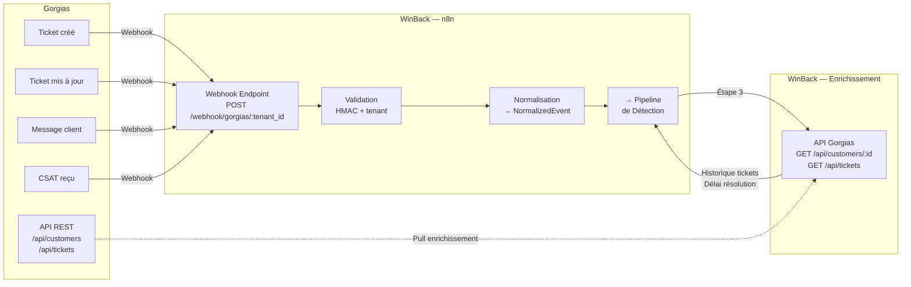

# Intégration : Gorgias

> **Statut** : ✅ Validé
> **Priorité** : P1 (V1 Beta M5)
> **Version** : 1.0
> **Dernière MAJ** : 2026-02-26
> **Dépend de** : `architecture-globale.md`, `detection-insatisfaction.md`, `modele-donnees.md`
> **Effort estimé** : 8-12h de développement

---

## 1. Objectif

Gorgias est le **connecteur helpdesk prioritaire** de WinBack Agent. C'est la source principale de signaux d'insatisfaction car il centralise toutes les interactions client : tickets email, chat, réseaux sociaux, téléphone. Cette intégration capte les nouveaux tickets, les escalades, les scores CSAT, et enrichit le profil client avec l'historique de support. Gorgias est le helpdesk #1 de l'écosystème Shopify en France.

---

## 2. User Stories

| ID | En tant que... | Je veux... | Afin de... | Priorité |
|----|---------------|-----------|-----------|----------|
| GR-01 | Tenant | Connecter mon compte Gorgias en 3 clics | Activer la détection sans compétence technique | P1 |
| GR-02 | Système | Recevoir les nouveaux tickets en temps réel | Détecter l'insatisfaction dès le premier message | P1 |
| GR-03 | Système | Recevoir les scores CSAT bas (≤ 2/5) | Réagir immédiatement aux clients très insatisfaits | P1 |
| GR-04 | Système | Détecter les escalades de tickets | Identifier les problèmes qui s'aggravent | P1 |
| GR-05 | Système | Enrichir le profil client avec l'historique de tickets | Calculer la fréquence de réclamations (composante C2 du scoring) | P1 |
| GR-06 | Système | Ignorer les messages d'agents et les auto-réponses | Éviter les faux positifs | P1 |
| GR-07 | Tenant | Voir le statut de ma connexion Gorgias dans le dashboard | Savoir si l'intégration fonctionne | P2 |
| GR-08 | Tenant | Déconnecter Gorgias proprement | Supprimer les webhooks et les clés API | P2 |

---

## 3. Architecture de l'Intégration



---

## 4. Authentification Gorgias

### 4.1 Méthode d'Authentification

Gorgias utilise l'**authentification HTTP Basic** (email + API key) pour son API REST, et des **signatures HMAC-SHA256** pour les webhooks.

| Élément | Valeur | Stockage |
|---------|--------|----------|
| API Base URL | `https://{subdomain}.gorgias.com/api` | `integrations.shop_domain` |
| API Email | Email du compte admin Gorgias | `integrations.config.api_email` |
| API Key | Clé API Gorgias | `integrations.api_key_encrypted` (AES-256) |
| Webhook Secret | Secret pour valider les webhooks | `integrations.webhook_secret` (AES-256) |

### 4.2 Obtention des Clés (Guide Tenant)

> 📸 Pour les captures d'écran et l'arborescence exacte des menus Gorgias 2025-2026, voir [`02-integrations/interfaces-reference-2026.md`](./interfaces-reference-2026.md).

```
ÉTAPE 1 — Créer une clé API dans Gorgias
  1. Connectez-vous à votre compte Gorgias
  2. Allez dans Settings → REST API
  3. Cliquez "Add REST API key"
  4. Entrez un nom : "WinBack Agent"
  5. Sélectionnez les permissions :
     - Tickets: Read
     - Customers: Read
     - Satisfaction surveys: Read
  6. Copiez la clé API générée

ÉTAPE 2 — Configurer dans WinBack
  1. Dashboard WinBack → Configuration → Intégrations
  2. Cliquez "Connecter Gorgias"
  3. Renseignez :
     - Sous-domaine Gorgias : ex. "maboutique" (de maboutique.gorgias.com)
     - Email du compte admin Gorgias
     - Clé API copiée à l'étape 1
  4. Cliquez "Tester la connexion"
  5. Si OK → WinBack crée automatiquement les webhooks dans Gorgias
```

### 4.3 Test de Connexion

```typescript
async function testGorgiasConnection(
  subdomain: string,
  email: string,
  apiKey: string
): Promise<{ success: boolean; error?: string; accountInfo?: GorgiasAccount }> {
  try {
    const response = await fetch(`https://${subdomain}.gorgias.com/api/account`, {
      headers: {
        'Authorization': `Basic ${Buffer.from(`${email}:${apiKey}`).toString('base64')}`,
        'Content-Type': 'application/json',
      },
    });

    if (response.status === 401) {
      return { success: false, error: 'Clé API invalide ou email incorrect.' };
    }
    if (response.status === 404) {
      return { success: false, error: `Le sous-domaine "${subdomain}" n\'existe pas sur Gorgias.` };
    }
    if (!response.ok) {
      return { success: false, error: `Erreur Gorgias (${response.status}): ${response.statusText}` };
    }

    const account = await response.json();
    return {
      success: true,
      accountInfo: {
        name: account.name,
        domain: account.domain,
        plan: account.plan?.name,
      },
    };
  } catch (error) {
    return { success: false, error: 'Impossible de contacter Gorgias. Vérifiez votre connexion.' };
  }
}
```

---

## 5. Configuration des Webhooks

### 5.1 Webhooks Créés Automatiquement

Après validation de la connexion, WinBack crée 3 webhooks dans Gorgias via l'API :

| # | Événement Gorgias | URL du Webhook | Trigger |
|---|-------------------|----------------|---------|
| 1 | `ticket-created` | `https://n8n.winback-agent.fr/webhook/gorgias/{tenant_id}/ticket-created` | Nouveau ticket |
| 2 | `ticket-updated` | `https://n8n.winback-agent.fr/webhook/gorgias/{tenant_id}/ticket-updated` | Ticket modifié |
| 3 | `satisfaction-survey` | `https://n8n.winback-agent.fr/webhook/gorgias/{tenant_id}/satisfaction` | CSAT reçu |

### 5.2 Création des Webhooks via API

```typescript
async function createGorgiasWebhooks(
  tenant: Tenant,
  integration: Integration
): Promise<{ success: boolean; webhookIds: number[] }> {
  const baseUrl = `https://${integration.shopDomain}.gorgias.com/api`;
  const authHeader = buildAuthHeader(integration);
  const webhookBaseUrl = `https://n8n.winback-agent.fr/webhook/gorgias/${tenant.id}`;

  const webhooksToCreate = [
    { url: `${webhookBaseUrl}/ticket-created`, event: 'ticket-created' },
    { url: `${webhookBaseUrl}/ticket-updated`, event: 'ticket-updated' },
    { url: `${webhookBaseUrl}/satisfaction`, event: 'satisfaction-survey' },
  ];

  const webhookIds: number[] = [];

  for (const wh of webhooksToCreate) {
    const response = await fetch(`${baseUrl}/api/integrations`, {
      method: 'POST',
      headers: { ...authHeader, 'Content-Type': 'application/json' },
      body: JSON.stringify({
        type: 'http',
        name: `WinBack Agent — ${wh.event}`,
        url: wh.url,
        http_method: 'POST',
        headers: {
          'X-Winback-Tenant': tenant.id,
          'Content-Type': 'application/json',
        },
        triggers: {
          [wh.event]: true,
        },
      }),
    });

    if (!response.ok) {
      throw new Error(`Failed to create webhook ${wh.event}: ${response.statusText}`);
    }

    const result = await response.json();
    webhookIds.push(result.id);
  }

  // Stocker les IDs des webhooks pour pouvoir les supprimer
  await db.integrations.update({
    where: { id: integration.id },
    data: {
      config: {
        ...integration.config,
        webhookIds,
      },
      status: 'ACTIVE',
      lastSyncAt: new Date(),
    },
  });

  return { success: true, webhookIds };
}
```

### 5.3 Validation HMAC des Webhooks

Gorgias signe les webhooks avec un HMAC-SHA256 dans le header `X-Gorgias-Signature`.

```typescript
function validateGorgiasWebhook(
  request: Request,
  webhookSecret: string
): boolean {
  const signature = request.headers.get('X-Gorgias-Signature');
  if (!signature) return false;

  const body = request.body; // Raw body string
  const expectedSignature = crypto
    .createHmac('sha256', webhookSecret)
    .update(body, 'utf8')
    .digest('base64');

  return crypto.timingSafeEqual(
    Buffer.from(signature),
    Buffer.from(expectedSignature)
  );
}
```

**Gestion de l'absence de signature :** Certaines configurations Gorgias n'incluent pas de signature HMAC (ancien plan ou configuration manuelle). Dans ce cas, WinBack se fie au `X-Winback-Tenant` header et au tenant_id dans l'URL pour l'authentification, avec un LOG warning.

---

## 6. Événements et Payloads

### 6.1 Événement : `ticket-created`

**Déclencheur :** Un nouveau ticket est créé dans Gorgias.

**Payload Gorgias :**

```json
{
  "id": 12345678,
  "uri": "/api/tickets/12345678",
  "external_id": null,
  "subject": "Problème avec ma commande #4567",
  "status": "open",
  "priority": "normal",
  "channel": "email",
  "via": "email",
  "from_agent": false,
  "requester": {
    "id": 9876543,
    "email": "marie.dupont@email.com",
    "name": "Marie Dupont",
    "firstname": "Marie",
    "lastname": "Dupont"
  },
  "assignee_user": null,
  "assignee_team": null,
  "tags": [
    { "id": 1, "name": "livraison" },
    { "id": 2, "name": "urgent" }
  ],
  "messages": [
    {
      "id": 111222333,
      "uri": "/api/messages/111222333",
      "message_id": "<abc123@email.com>",
      "ticket_id": 12345678,
      "channel": "email",
      "via": "email",
      "source": {
        "type": "customer",
        "from": { "name": "Marie Dupont", "address": "marie.dupont@email.com" },
        "to": [{ "name": "Support", "address": "support@maboutique.com" }]
      },
      "sender": {
        "id": 9876543,
        "email": "marie.dupont@email.com"
      },
      "subject": "Problème avec ma commande #4567",
      "body_text": "Bonjour, j'ai commandé il y a 2 semaines et je n'ai toujours rien reçu. C'est inacceptable, j'attends une réponse rapide. Marie Dupont",
      "body_html": "<p>Bonjour, j'ai commandé il y a 2 semaines...</p>",
      "stripped_text": "Bonjour, j'ai commandé il y a 2 semaines et je n'ai toujours rien reçu. C'est inacceptable, j'attends une réponse rapide.",
      "created_datetime": "2026-02-23T14:23:45.000Z",
      "sent_datetime": "2026-02-23T14:23:45.000Z",
      "failed_datetime": null,
      "opened_datetime": null,
      "attachments": []
    }
  ],
  "created_datetime": "2026-02-23T14:23:45.000Z",
  "updated_datetime": "2026-02-23T14:23:45.000Z",
  "opened_datetime": "2026-02-23T14:23:45.000Z",
  "closed_datetime": null,
  "snooze_datetime": null,
  "last_received_message_datetime": "2026-02-23T14:23:45.000Z",
  "last_message_datetime": "2026-02-23T14:23:45.000Z",
  "spam": false,
  "meta": {
    "order_id": "4567",
    "order_number": "#4567"
  }
}
```

### 6.2 Mapping vers NormalizedEvent

```typescript
function normalizeGorgiasTicketCreated(
  payload: GorgiasTicketPayload,
  tenantId: string
): NormalizedEvent | null {

  // FILTRE 1 — Ignorer les tickets spam
  if (payload.spam === true) return null;

  // FILTRE 2 — Ignorer les tickets créés par un agent
  if (payload.from_agent === true) return null;

  // FILTRE 3 — Ignorer les tickets sans message client
  const customerMessages = (payload.messages || []).filter(
    m => m.source?.type === 'customer'
  );
  if (customerMessages.length === 0) return null;

  // FILTRE 4 — Ignorer les tags exclus (configuration tenant)
  const excludeTags = getTenantExcludeTags(tenantId);
  const ticketTags = payload.tags.map(t => t.name.toLowerCase());
  if (excludeTags.some(tag => ticketTags.includes(tag.toLowerCase()))) return null;

  // Prendre le dernier message du client
  const latestMessage = customerMessages.sort(
    (a, b) => new Date(b.created_datetime).getTime() - new Date(a.created_datetime).getTime()
  )[0];

  // Préférer stripped_text (sans signatures, citations) à body_text
  const messageBody = latestMessage.stripped_text || latestMessage.body_text || payload.subject;

  return {
    eventId: `gorgias-ticket-${payload.id}`,
    tenantId,
    platform: 'GORGIAS',
    eventType: 'NEW_TICKET',
    customer: {
      externalId: String(payload.requester.id),
      email: payload.requester.email,
      firstName: payload.requester.firstname || extractFirstName(payload.requester.name),
      lastName: payload.requester.lastname || extractLastName(payload.requester.name),
    },
    content: {
      subject: payload.subject,
      body: messageBody,
      language: 'fr', // Détecté à l'étape d'analyse
    },
    context: {
      csatScore: undefined,
      orderValue: undefined,
      ticketPriority: payload.priority,
      isRepeatIssue: false, // Enrichi plus tard
    },
    metadata: {
      gorgiasTicketId: payload.id,
      gorgiasChannel: payload.channel,
      gorgiasVia: payload.via,
      gorgiasOrderId: payload.meta?.order_id,
      gorgiasOrderNumber: payload.meta?.order_number,
      tagNames: ticketTags,
    },
    receivedAt: new Date(),
    rawPayload: payload,
  };
}
```

---

### 6.3 Événement : `ticket-updated`

**Déclencheur :** Un ticket existant est modifié (nouveau message, changement de statut, assignation, etc.)

**Signaux d'insatisfaction extraits des mises à jour :**

| Changement détecté | Événement WinBack | Condition |
|--------------------|--------------------|-----------|
| Nouveau message du client | `NEW_TICKET` (nouveau signal) | `source.type === 'customer'` |
| Priorité augmentée | `TICKET_ESCALATION` | `priority` augmente (normal → high/urgent) |
| Assignation à une équipe | `TICKET_ESCALATION` | `assignee_team` change |
| Ticket réouvert | `NEW_TICKET` (récidive) | `status` passe de closed → open |
| Nouveau message de l'agent | IGNORÉ | `source.type === 'agent'` |
| Changement de tags | IGNORÉ (V1) | — |

```typescript
function normalizeGorgiasTicketUpdated(
  payload: GorgiasTicketPayload,
  previousState: GorgiasTicketCache | null,
  tenantId: string
): NormalizedEvent | null {

  // CAS 1 — Nouveau message du client
  const newCustomerMessages = findNewCustomerMessages(payload, previousState);
  if (newCustomerMessages.length > 0) {
    const latestNewMessage = newCustomerMessages[0];
    return {
      eventId: `gorgias-msg-${latestNewMessage.id}`,
      tenantId,
      platform: 'GORGIAS',
      eventType: 'NEW_TICKET', // Traité comme un nouveau signal
      customer: {
        externalId: String(payload.requester.id),
        email: payload.requester.email,
        firstName: payload.requester.firstname,
        lastName: payload.requester.lastname,
      },
      content: {
        subject: payload.subject,
        body: latestNewMessage.stripped_text || latestNewMessage.body_text,
        language: 'fr',
      },
      context: {
        ticketPriority: payload.priority,
        isRepeatIssue: true, // Ce ticket a déjà des messages → conversation en cours
      },
      metadata: {
        gorgiasTicketId: payload.id,
        gorgiasMessageId: latestNewMessage.id,
        messageIndex: payload.messages.filter(m => m.source?.type === 'customer').length,
      },
      receivedAt: new Date(),
      rawPayload: payload,
    };
  }

  // CAS 2 — Escalade (priorité augmentée ou réassignation)
  if (previousState) {
    const priorityEscalated = isPriorityHigher(payload.priority, previousState.priority);
    const teamChanged = payload.assignee_team?.id !== previousState.assigneeTeamId;

    if (priorityEscalated || teamChanged) {
      // Construire un message synthétique pour l'escalade
      const syntheticBody = `Ticket #${payload.id} escaladé. `
        + (priorityEscalated ? `Priorité : ${previousState.priority} → ${payload.priority}. ` : '')
        + (teamChanged ? `Réassigné à l'équipe ${payload.assignee_team?.name || 'autre'}. ` : '')
        + `Sujet original : "${payload.subject}".`;

      return {
        eventId: `gorgias-escalation-${payload.id}-${Date.now()}`,
        tenantId,
        platform: 'GORGIAS',
        eventType: 'TICKET_ESCALATION',
        customer: {
          externalId: String(payload.requester.id),
          email: payload.requester.email,
          firstName: payload.requester.firstname,
          lastName: payload.requester.lastname,
        },
        content: {
          subject: `Escalade: ${payload.subject}`,
          body: syntheticBody,
          language: 'fr',
        },
        context: {
          ticketPriority: payload.priority,
          isRepeatIssue: true,
        },
        metadata: {
          gorgiasTicketId: payload.id,
          escalationType: priorityEscalated ? 'priority' : 'reassignment',
          previousPriority: previousState.priority,
        },
        receivedAt: new Date(),
        rawPayload: payload,
      };
    }
  }

  // CAS 3 — Ticket réouvert
  if (previousState?.status === 'closed' && payload.status === 'open') {
    const lastCustomerMsg = payload.messages
      ?.filter(m => m.source?.type === 'customer')
      .sort((a, b) => new Date(b.created_datetime).getTime() - new Date(a.created_datetime).getTime())[0];

    return {
      eventId: `gorgias-reopen-${payload.id}`,
      tenantId,
      platform: 'GORGIAS',
      eventType: 'NEW_TICKET',
      customer: {
        externalId: String(payload.requester.id),
        email: payload.requester.email,
        firstName: payload.requester.firstname,
        lastName: payload.requester.lastname,
      },
      content: {
        subject: `[Réouvert] ${payload.subject}`,
        body: lastCustomerMsg?.stripped_text || `Ticket réouvert: ${payload.subject}`,
        language: 'fr',
      },
      context: {
        ticketPriority: payload.priority,
        isRepeatIssue: true,
      },
      metadata: {
        gorgiasTicketId: payload.id,
        reopened: true,
      },
      receivedAt: new Date(),
      rawPayload: payload,
    };
  }

  // Aucun signal d'insatisfaction → ignorer
  return null;
}

function isPriorityHigher(current: string, previous: string): boolean {
  const levels: Record<string, number> = { low: 0, normal: 1, high: 2, urgent: 3 };
  return (levels[current] ?? 0) > (levels[previous] ?? 0);
}
```

### 6.4 Cache d'État des Tickets

Pour détecter les changements (escalade, réouverture), WinBack maintient un cache léger des tickets récemment vus :

```typescript
interface GorgiasTicketCache {
  ticketId: number;
  tenantId: string;
  status: string;
  priority: string;
  assigneeTeamId: number | null;
  lastMessageId: number | null;
  lastSeenAt: Date;
}

// Stockage : en mémoire n8n (TTL 24h) ou Redis en Phase 2
// Clé : gorgias-ticket-{tenant_id}-{ticket_id}
```

---

### 6.5 Événement : `satisfaction-survey`

**Déclencheur :** Un client répond à l'enquête de satisfaction (CSAT) de Gorgias.

**Payload Gorgias :**

```json
{
  "id": 55667788,
  "ticket_id": 12345678,
  "score": 1,
  "comment": "Service client nul, aucune réponse en 3 jours.",
  "scored_datetime": "2026-02-23T18:30:00.000Z",
  "customer": {
    "id": 9876543,
    "email": "marie.dupont@email.com",
    "name": "Marie Dupont"
  },
  "meta": {
    "ticket_subject": "Problème avec ma commande #4567"
  }
}
```

**Mapping :**

```typescript
function normalizeGorgiasSatisfaction(
  payload: GorgiasSatisfactionPayload,
  tenantId: string
): NormalizedEvent | null {

  // Score CSAT : 1-5 dans Gorgias
  // Seuls les scores ≤ 2 sont des signaux d'insatisfaction
  if (payload.score > 2) {
    // Score 3 : signal faible (V2 — configurable)
    // Score 4-5 : positif → mettre à jour le sentiment du client positivement
    if (payload.score >= 4) {
      updateCustomerPositiveSentiment(tenantId, payload.customer.id, payload.score);
    }
    return null;
  }

  // Score 1 ou 2 → signal fort d'insatisfaction
  const body = payload.comment
    ? `Score CSAT : ${payload.score}/5. Commentaire : "${payload.comment}"`
    : `Score CSAT : ${payload.score}/5 (sans commentaire).`;

  return {
    eventId: `gorgias-csat-${payload.id}`,
    tenantId,
    platform: 'GORGIAS',
    eventType: 'LOW_CSAT',
    customer: {
      externalId: String(payload.customer.id),
      email: payload.customer.email,
      firstName: extractFirstName(payload.customer.name),
      lastName: extractLastName(payload.customer.name),
    },
    content: {
      subject: `CSAT ${payload.score}/5 — ${payload.meta?.ticket_subject || 'Enquête satisfaction'}`,
      body,
      language: 'fr',
    },
    context: {
      csatScore: payload.score,
      ticketPriority: 'high', // CSAT bas = priorité haute automatique
      isRepeatIssue: false,
    },
    metadata: {
      gorgiasTicketId: payload.ticket_id,
      csatSurveyId: payload.id,
      csatComment: payload.comment,
    },
    receivedAt: new Date(),
    rawPayload: payload,
  };
}
```

**Traitement spécial des CSAT :**

| Score CSAT | Interprétation | Action WinBack |
|------------|----------------|----------------|
| 1/5 | Très insatisfait | Signal fort → pipeline complet, urgence `high` |
| 2/5 | Insatisfait | Signal fort → pipeline complet, urgence `medium` |
| 3/5 | Neutre / Mitigé | Ignoré en V1 (configurable en V2, signal faible) |
| 4/5 | Satisfait | Positif → mise à jour du sentiment client |
| 5/5 | Très satisfait | Positif → mise à jour du sentiment client |

---

## 7. Enrichissement Client via API Gorgias

### 7.1 Données Récupérées

Quand un client est détecté dans le pipeline (Étape 3 — Enrichissement), WinBack appelle l'API Gorgias pour obtenir l'historique de support :

**Endpoint 1 — Profil client :**

```
GET https://{subdomain}.gorgias.com/api/customers/{customer_id}
```

**Données extraites :**

```typescript
interface GorgiasCustomerData {
  id: number;
  email: string;
  name: string;
  note: string;                   // Notes internes de l'agent
  external_id: string | null;     // ID Shopify/PrestaShop
  data: {
    total_orders_count?: number;
    total_spent?: string;
    shopify_domain?: string;
  };
  created_datetime: string;
  updated_datetime: string;
}
```

**Endpoint 2 — Tickets du client (90 jours) :**

```
GET https://{subdomain}.gorgias.com/api/tickets?customer_id={customer_id}&created_datetime__gte={90_days_ago}&order_by=created_datetime&order_dir=desc&limit=50
```

**Données extraites :**

```typescript
interface GorgiasTicketSummary {
  id: number;
  subject: string;
  status: 'open' | 'pending' | 'closed';
  priority: 'low' | 'normal' | 'high' | 'urgent';
  channel: string;
  created_datetime: string;
  closed_datetime: string | null;
  satisfaction_survey?: {
    score: number;
    comment: string;
  };
}
```

### 7.2 Calculs d'Enrichissement

```typescript
function enrichFromGorgias(
  customerData: GorgiasCustomerData,
  tickets: GorgiasTicketSummary[]
): Partial<CustomerEnrichment> {

  // Tickets sur 90 jours
  const totalTickets90d = tickets.length;

  // Tickets ouverts actuellement
  const openTickets = tickets.filter(t => t.status === 'open').length;

  // Délai moyen de résolution (tickets fermés uniquement)
  const closedTickets = tickets.filter(t => t.closed_datetime);
  const avgResolutionHours = closedTickets.length > 0
    ? closedTickets.reduce((sum, t) => {
        const opened = new Date(t.created_datetime);
        const closed = new Date(t.closed_datetime!);
        return sum + (closed.getTime() - opened.getTime()) / (1000 * 60 * 60);
      }, 0) / closedTickets.length
    : null;

  // Sentiments précédents (CSAT des tickets fermés)
  const previousCSAT = tickets
    .filter(t => t.satisfaction_survey?.score !== undefined)
    .map(t => t.satisfaction_survey!.score);

  // Identifier si c'est un problème récurrent (même sujet)
  // Heuristique simple : mots-clés communs dans les sujets
  const isRepeatIssue = hasOverlappingSubjects(tickets);

  return {
    totalTickets90d,
    openTickets,
    avgResolutionTimeHours: avgResolutionHours ? Math.round(avgResolutionHours * 10) / 10 : null,
    previousSentiments: previousCSAT,
    isRepeatIssue,
  };
}

function hasOverlappingSubjects(tickets: GorgiasTicketSummary[]): boolean {
  if (tickets.length < 2) return false;

  // Comparer les 2 tickets les plus récents
  const subjects = tickets.slice(0, 2).map(t =>
    t.subject.toLowerCase().replace(/[^a-zàâéèêëïôùûüç\s]/g, '')
  );

  // Mots significatifs communs (hors mots vides)
  const stopWords = new Set(['le', 'la', 'les', 'de', 'du', 'des', 'un', 'une', 'ma', 'mon', 'mes', 'avec', 'pour', 'dans', 'sur', 'par']);
  const words1 = new Set(subjects[0].split(/\s+/).filter(w => w.length > 2 && !stopWords.has(w)));
  const words2 = new Set(subjects[1].split(/\s+/).filter(w => w.length > 2 && !stopWords.has(w)));

  const commonWords = [...words1].filter(w => words2.has(w));
  return commonWords.length >= 2; // Au moins 2 mots significatifs en commun
}
```

### 7.3 Rate Limiting API Gorgias

| Plan Gorgias | Rate Limit | Stratégie WinBack |
|-------------|------------|-------------------|
| Starter | 2 req/s | Cache enrichissement 6h, batch nocturne |
| Basic | 5 req/s | Cache enrichissement 6h |
| Pro | 10 req/s | Cache enrichissement 3h |
| Advanced | 20 req/s | Cache enrichissement 1h |

```typescript
// Rate limiter simple (token bucket)
const gorgiasRateLimiter = new Map<string, { tokens: number; lastRefill: Date }>();

async function callGorgiasApi(
  tenantId: string,
  endpoint: string,
  maxRequestsPerSecond: number = 2
): Promise<Response> {
  await waitForToken(tenantId, maxRequestsPerSecond);
  const response = await fetch(endpoint, { headers: authHeaders });

  // Gérer le 429 (rate limit)
  if (response.status === 429) {
    const retryAfter = parseInt(response.headers.get('Retry-After') || '5');
    logger.warn(`Gorgias rate limit hit for tenant ${tenantId}, waiting ${retryAfter}s`);
    await sleep(retryAfter * 1000);
    return callGorgiasApi(tenantId, endpoint, maxRequestsPerSecond); // Retry
  }

  return response;
}
```

---

## 8. Synchronisation des Clients

### 8.1 Sync Initiale (Onboarding)

Quand un tenant connecte Gorgias pour la première fois, WinBack synchronise les clients existants :

```
ÉTAPE 1 — Récupérer les clients Gorgias
  GET /api/customers?limit=100&order_by=updated_datetime&order_dir=desc
  → Paginer jusqu'à la limite du palier CoY (10 000 clients, ADR-017)

ÉTAPE 2 — Pour chaque client avec ≥ 1 commande
  → Créer/mettre à jour dans la table customers
  → external_id = gorgias_customer_id
  → platform_source = 'GORGIAS'
  → Importer email, nom, prénom

ÉTAPE 3 — Pour chaque client importé
  → Récupérer les tickets des 90 derniers jours
  → Calculer un score de churn initial (mode batch)
  → Stocker sans déclencher d'action (observation uniquement)

Temps estimé : 5-20 minutes selon le volume
Affiché dans le dashboard : "Synchronisation en cours... 847/1200 clients importés"
```

### 8.2 Sync Incrémentale (Toutes les 6h)

```
CRON toutes les 6h :
  1. GET /api/customers?updated_datetime__gte={last_sync_at}&limit=100
  2. Pour chaque client modifié :
     → Mettre à jour les données dans la table customers
  3. Mettre à jour integrations.last_sync_at
```

---

## 9. Gestion de la Déconnexion

### 9.1 Processus de Déconnexion

```
Quand le tenant clique "Déconnecter Gorgias" :

  1. Confirmation : "Êtes-vous sûr ? WinBack ne recevra plus de tickets Gorgias."
  2. Supprimer les webhooks dans Gorgias :
     → DELETE /api/integrations/{webhook_id} pour chaque webhook créé
  3. Mettre à jour l'intégration :
     → status = 'DISABLED'
     → api_key_encrypted = NULL
     → api_secret_encrypted = NULL
     → webhook_secret = NULL
     → config.webhookIds = []
  4. Les données clients existantes sont CONSERVÉES
     (pas de suppression des scores/actions existants)
  5. Toast : "Gorgias a été déconnecté. Vos données historiques sont conservées."
```

### 9.2 Suppression des Webhooks

```typescript
async function disconnectGorgias(tenant: Tenant, integration: Integration): Promise<void> {
  const baseUrl = `https://${integration.shopDomain}.gorgias.com/api`;
  const authHeader = buildAuthHeader(integration);

  // Supprimer chaque webhook créé par WinBack
  const webhookIds = integration.config?.webhookIds || [];
  for (const webhookId of webhookIds) {
    try {
      await fetch(`${baseUrl}/api/integrations/${webhookId}`, {
        method: 'DELETE',
        headers: authHeader,
      });
    } catch (error) {
      // Log mais ne pas bloquer la déconnexion
      logger.warn(`Failed to delete Gorgias webhook ${webhookId}: ${error.message}`);
    }
  }

  // Nettoyer les données sensibles
  await db.integrations.update({
    where: { id: integration.id },
    data: {
      status: 'DISABLED',
      apiKeyEncrypted: null,
      apiSecretEncrypted: null,
      webhookSecret: null,
      config: { webhookIds: [] },
    },
  });
}
```

---

## 10. Gestion des Erreurs

### 10.1 Erreurs Webhook

| Erreur | Cause | Comportement |
|--------|-------|--------------|
| Signature HMAC invalide | Webhook falsifié ou secret changé | Rejeter, LOG error, alerter admin après 10 occurrences |
| Tenant inactif | Abonnement expiré/annulé | Ignorer silencieusement, LOG info |
| Intégration disabled | Gorgias déconnecté | Ignorer, LOG info |
| Payload malformé | Bug Gorgias ou format inattendu | LOG error, stocker dans DLQ |
| Timeout n8n | Surcharge de traitement | Gorgias retry automatiquement (3x) |

### 10.2 Erreurs API

| Erreur | Cause | Comportement |
|--------|-------|--------------|
| 401 Unauthorized | Clé API révoquée ou changée | Marquer intégration `ERROR`, notifier tenant |
| 404 Not Found | Client ou ticket supprimé | Ignorer, LOG info |
| 429 Too Many Requests | Rate limit dépassé | Attendre Retry-After, retry automatique |
| 500/503 Server Error | Gorgias down | Retry avec backoff (3x), skip enrichissement si échec |

### 10.3 Auto-Détection de Problèmes

```typescript
// Vérification de santé toutes les heures
async function checkGorgiasHealth(integration: Integration): Promise<HealthStatus> {
  // Test 1 : API accessible
  const apiOk = await testGorgiasConnection(
    integration.shopDomain,
    integration.config.apiEmail,
    decrypt(integration.apiKeyEncrypted)
  );

  // Test 2 : Webhooks toujours actifs dans Gorgias
  let webhooksOk = true;
  for (const webhookId of integration.config.webhookIds || []) {
    const response = await fetch(
      `https://${integration.shopDomain}.gorgias.com/api/integrations/${webhookId}`,
      { headers: buildAuthHeader(integration) }
    );
    if (response.status === 404) {
      webhooksOk = false;
      logger.warn(`Gorgias webhook ${webhookId} not found — may have been deleted manually`);
    }
  }

  // Test 3 : Dernier webhook reçu < 24h (si le tenant a du trafic)
  const lastActivity = integration.lastSyncAt;
  const noRecentActivity = lastActivity &&
    differenceInHours(new Date(), lastActivity) > 24;

  if (!apiOk.success) {
    await markIntegrationError(integration.id, 'API inaccessible');
    return 'ERROR';
  }
  if (!webhooksOk) {
    await recreateGorgiasWebhooks(integration); // Auto-réparation
    return 'WARNING';
  }
  if (noRecentActivity) {
    return 'WARNING'; // Peut être normal si peu de tickets
  }

  return 'HEALTHY';
}
```

---

## 11. Mapping Bidirectionnel Client

### 11.1 Identification Unique

Un même client peut exister dans Gorgias ET dans Shopify/PrestaShop. Le mapping se fait via l'email :

```
Client WinBack (table customers)
  ├── external_id = Gorgias customer_id (source helpdesk)
  ├── email = email (clé de jointure universelle)
  └── metadata.shopify_customer_id = Shopify customer_id

Recherche d'un client :
  1. Chercher par (tenant_id, external_id, platform_source='GORGIAS')
  2. Si non trouvé → chercher par (tenant_id, email)
  3. Si trouvé par email mais platform_source différente :
     → Enrichir le client existant avec les données Gorgias
     → Ajouter gorgias_customer_id dans metadata
  4. Si non trouvé du tout → créer un nouveau client
```

### 11.2 Résolution des Conflits

```
SI un client existe avec platform_source = 'SHOPIFY' et qu'un ticket Gorgias arrive :
  → Ne PAS créer de doublon
  → Mettre à jour le client existant avec les données Gorgias
  → Stocker le gorgias_customer_id dans metadata
  → Le client garde platform_source = 'SHOPIFY' (source primaire = e-commerce)

SI un client existe avec platform_source = 'GORGIAS' et qu'une commande Shopify arrive :
  → Enrichir le client avec les données Shopify (LTV, commandes)
  → Mettre à jour platform_source → 'SHOPIFY' (source plus riche)
  → Conserver le gorgias_customer_id dans metadata
```

---

## 12. Dashboard : Vue Intégration Gorgias

### 12.1 État de l'Intégration

```
┌──────────────────────────────────────────────────────────────┐
│  🟢 Gorgias — Connecté                                      │
│                                                              │
│  Domaine : maboutique.gorgias.com                           │
│  Dernière sync : il y a 5 minutes                           │
│  Statut webhooks : 3/3 actifs                               │
│                                                              │
│  Ce mois :                                                   │
│  • Tickets reçus : 156                                       │
│  • Tickets analysés : 98 (63%)                               │
│  • Tickets ignorés : 58 (agents, spam, positifs)             │
│  • Scores CSAT reçus : 34 (dont 8 ≤ 2/5)                    │
│  • Escalades détectées : 5                                   │
│                                                              │
│  [Reconfigurer]  [Tester la connexion]  [Déconnecter]       │
└──────────────────────────────────────────────────────────────┘
```

---

## 13. Permissions et Sécurité

### 13.1 Permissions API Requises

| Permission Gorgias | Niveau | Usage WinBack |
|--------------------|--------|---------------|
| Tickets: Read | Obligatoire | Lire les tickets et messages pour l'analyse |
| Customers: Read | Obligatoire | Profil client et historique pour l'enrichissement |
| Satisfaction: Read | Obligatoire | Scores CSAT |
| Integrations: Write | Obligatoire | Créer/supprimer les webhooks automatiquement |
| Tickets: Write | NON requis | WinBack ne modifie jamais les tickets Gorgias |
| Customers: Write | NON requis | WinBack ne modifie jamais les données Gorgias |

### 13.2 Données Sensibles

| Donnée | Traitement | Stockage |
|--------|------------|----------|
| API Key Gorgias | Chiffrée AES-256 | `integrations.api_key_encrypted` |
| Webhook Secret | Chiffré AES-256 | `integrations.webhook_secret` |
| Email du client | Stocké pour matching | `customers.email` (chiffré en V2) |
| Contenu du message | Analysé par Mistral, pas stocké en clair dans les logs IA | `rawPayload` dans n8n (TTL 24h) |
| Données PII dans les logs IA | JAMAIS stockées | `ai_decision_logs` contient uniquement des IDs et des scores |

---

## 14. Limites et Évolutions

### 14.1 Limites V1

| Limite | Impact | Évolution |
|--------|--------|-----------|
| Webhooks uniquement (pas de polling) | Si un webhook est manqué, l'événement est perdu | V2 : sync de rattrapage toutes les heures |
| Pas de pièces jointes | Images de produits endommagés non analysées | V2 : vision multimodale |
| Pas de tags Gorgias dans le scoring | Les tags manuels de l'agent ne sont pas utilisés | V2 : Tags comme signal additionnel |
| Pas de macros/règles Gorgias | WinBack n'interagit pas avec les macros Gorgias | Hors scope |
| Pas de sidebar Gorgias | Pas de widget WinBack dans l'interface Gorgias | V3 : Gorgias App |

### 14.2 Roadmap d'Évolution

| Version | Fonctionnalité | Effort |
|---------|---------------|--------|
| V1.1 | Sync de rattrapage (reconciliation hourly) | 4h |
| V1.2 | Support des tags Gorgias comme signal additionnel | 2h |
| V2.0 | Analyse des pièces jointes (Claude Vision) | 8h |
| V2.1 | Gorgias Marketplace App (sidebar widget) | 20h |
| V3.0 | Bidirectionnel : créer des notes internes dans Gorgias depuis WinBack | 6h |

---

## 15. Critères d'Acceptation

| Test | Input | Output attendu | Statut |
|------|-------|----------------|--------|
| Connexion réussie | Subdomain + email + API key valides | "Connexion réussie", 3 webhooks créés | ⬜ |
| Connexion échouée — mauvaise clé | API key invalide | Erreur "Clé API invalide", pas de webhook créé | ⬜ |
| Connexion échouée — mauvais domaine | Subdomain inexistant | Erreur "Le sous-domaine n'existe pas" | ⬜ |
| Ticket créé — réclamation | Webhook ticket-created, message de plainte | NormalizedEvent type NEW_TICKET, pipeline déclenché | ⬜ |
| Ticket créé — agent | Webhook ticket-created, from_agent=true | Ignoré | ⬜ |
| Ticket créé — spam | Webhook ticket-created, spam=true | Ignoré | ⬜ |
| Ticket créé — tag exclu | Webhook ticket-created, tag "test" exclu | Ignoré | ⬜ |
| Ticket updated — nouveau message client | Nouveau message source=customer | NormalizedEvent, isRepeatIssue=true | ⬜ |
| Ticket updated — message agent | Nouveau message source=agent | Ignoré | ⬜ |
| Ticket updated — escalade priorité | Priorité normal → urgent | NormalizedEvent type TICKET_ESCALATION | ⬜ |
| Ticket réouvert | Status closed → open | NormalizedEvent type NEW_TICKET, reopened=true | ⬜ |
| CSAT 1/5 | Satisfaction score=1 | NormalizedEvent type LOW_CSAT, urgence high | ⬜ |
| CSAT 2/5 avec commentaire | Score=2, comment="Nul" | NormalizedEvent avec body incluant le commentaire | ⬜ |
| CSAT 5/5 | Score=5 | Ignoré, mise à jour sentiment positif | ⬜ |
| Enrichissement client | Customer avec 3 tickets en 90j | totalTickets90d=3, avgResolutionHours calculé | ⬜ |
| Client doublon email | Client Gorgias avec même email qu'un client Shopify | Pas de doublon, enrichissement du client existant | ⬜ |
| Rate limit 429 | API Gorgias retourne 429 | Attente Retry-After, retry automatique | ⬜ |
| Déconnexion | Clic "Déconnecter" | 3 webhooks supprimés, clés effacées, données conservées | ⬜ |
| Webhook HMAC invalide | Signature falsifiée | Rejeté, LOG error | ⬜ |
| Auto-réparation webhooks | Webhook supprimé manuellement dans Gorgias | Recréé automatiquement au health check | ⬜ |

---

## 16. Questions Ouvertes

- [x] **OAuth vs API Key** : ~~OAuth ou API Key ?~~ → **API Key en V1.** Plus rapide à implémenter (1 jour vs 5 jours pour OAuth). Le tenant copie-colle sa clé dans le wizard. OAuth en V2 si on publie sur la marketplace Gorgias (meilleure UX, installation en 1 clic). *(Décidé 2026-02-26)*
- [x] **CSAT 3/5** : ~~signal faible ou ignorer ?~~ → **Signal faible.** Un CSAT 3/5 contribue au scoring churn avec un poids de 0.3 (vs 0.8 pour un 1/5). Le tenant peut configurer son seuil CSAT dans les settings (défaut : ≤3/5 = signal). *(Décidé 2026-02-26)*
- [x] **Volume de webhooks** : ~~batching nécessaire ?~~ → **Non en V1.** n8n gère les webhooks séquentiellement. Pour un tenant à 500 tickets/jour, ça représente ~21 webhooks/heure — négligeable. Queue Redis pour les gros volumes en V2 si un tenant dépasse 2 000 tickets/jour. *(Décidé 2026-02-26)*
- [x] **Historique initial** : ~~30 derniers jours ou nouveaux seulement ?~~ → **7 derniers jours.** Scorer les tickets des 7 derniers jours lors de la sync initiale pour avoir des données immédiates dans le dashboard (Time to Value <48h). 30 jours = trop de bruit et coût API Mistral. *(Décidé 2026-02-26)*
- [x] **Multi-canaux Gorgias** : ~~traitement différencié ?~~ → **Non en V1.** Tous les canaux Gorgias sont traités comme du texte (NormalizedEvent). Le champ `channel` est stocké pour analytics. V2 : scoring différencié par canal (messages publics Instagram/Facebook = poids plus élevé car impact réputation). *(Décidé 2026-02-26)*

---

## 17. Historique des Changements

| Date | Changement | Auteur |
|------|-----------|--------|
| 2026-02-23 | Création du document — intégration Gorgias V1 | CoYia |