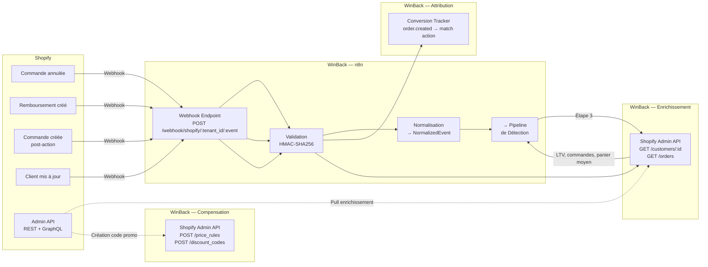

# Intégration : Shopify

> **Statut** : ✅ Validé
> **Priorité** : P1 (V1 Beta M5)
> **Version** : 1.0
> **Dernière MAJ** : 2026-02-26
> **Dépend de** : `architecture-globale.md`, `detection-insatisfaction.md`, `scoring-churn.md`, `generation-messages.md`, `modele-donnees.md`
> **Effort estimé** : 10-14h de développement

---

## 1. Objectif

Shopify est le **connecteur e-commerce prioritaire** de WinBack Agent. Il remplit **3 rôles critiques** :

1. **Source de signaux** : Annulations, remboursements, retours produits → signaux de churn
2. **Source d'enrichissement** : Données client (LTV, commandes, panier moyen) → composantes C3 et C5 du scoring
3. **Source de conversion** : Nouvelles commandes post-action → attribution et calcul du ROI

Shopify est la plateforme e-commerce #1 en France pour les PME avec 30%+ de parts de marché sur le segment cible.

---

## 2. User Stories

| ID | En tant que... | Je veux... | Afin de... | Priorité |
|----|---------------|-----------|-----------|----------|
| SH-01 | Tenant | Connecter ma boutique Shopify en 3 clics | Importer mes clients et activer la détection | P1 |
| SH-02 | Système | Recevoir les annulations de commandes en temps réel | Détecter les signaux transactionnels de churn | P1 |
| SH-03 | Système | Recevoir les remboursements | Détecter les retours et l'insatisfaction produit | P1 |
| SH-04 | Système | Synchroniser les données client (LTV, commandes) | Calculer le score de churn avec des données à jour | P1 |
| SH-05 | Système | Détecter les nouvelles commandes pour l'attribution | Mesurer le ROI des actions de récupération | P1 |
| SH-06 | Système | Créer des codes promo via l'API Shopify | Générer automatiquement les compensations | P2 |
| SH-07 | Tenant | Voir le nombre de clients synchronisés | Vérifier que l'import est complet | P2 |
| SH-08 | Tenant | Déconnecter Shopify proprement | Supprimer les webhooks et les accès | P2 |
| SH-09 | Système | Ignorer les annulations pour fraude ou rupture de stock | Éviter les faux positifs | P1 |

---

## 3. Architecture de l'Intégration



---

## 4. Authentification Shopify

### 4.1 Méthode : Custom App (Private App)

WinBack utilise une **Custom App** Shopify (pas une Public App Marketplace en V1) pour éviter le processus de validation Shopify. Le tenant crée l'app manuellement dans son admin.

| Élément | Valeur | Stockage |
|---------|--------|----------|
| Shop Domain | `{store}.myshopify.com` | `integrations.shop_domain` |
| Admin API Access Token | Token d'accès | `integrations.api_key_encrypted` (AES-256) |
| API Secret Key | Secret pour webhooks HMAC | `integrations.webhook_secret` (AES-256) |
| API Version | `2025-01` (stable) | Hardcoded, MAJ semestrielle |

### 4.2 Permissions (Scopes) Requises

| Scope | Niveau | Usage WinBack |
|-------|--------|---------------|
| `read_customers` | Obligatoire | Profil client, LTV, historique |
| `read_orders` | Obligatoire | Commandes, annulations, remboursements |
| `write_discounts` | Optionnel (recommandé) | Création automatique de codes promo |
| `read_products` | Tout tenant CoY | Scoring produit V2 — catégorie récurrente absente, retour même produit, baisse panier moyen |

### 4.3 Guide de Connexion (Tenant)

> 📸 Pour les captures d'écran et l'arborescence exacte des menus Shopify 2025-2026 (Partner Dashboard → Dev Dashboard), voir [`02-integrations/interfaces-reference-2026.md`](./interfaces-reference-2026.md).

```
ÉTAPE 1 — Créer une Custom App dans Shopify
  1. Admin Shopify → Settings → Apps and sales channels → Develop apps
  2. Cliquez "Create an app"
  3. Nom de l'app : "WinBack Agent"
  4. Configuration → Admin API access scopes :
     ☑ read_customers
     ☑ read_orders
     ☑ write_discounts (optionnel)
     ☑ read_products (scoring produit V2, tout tenant CoY)
  5. Cliquez "Install app"
  6. Copiez le "Admin API access token" (affiché une seule fois !)
  7. Allez dans "API credentials" et copiez le "API secret key"

ÉTAPE 2 — Configurer dans WinBack
  1. Dashboard WinBack → Configuration → Intégrations
  2. Cliquez "Connecter Shopify"
  3. Renseignez :
     - Domaine boutique : ex. "maboutique" (de maboutique.myshopify.com)
     - Admin API Access Token
     - API Secret Key
  4. Cliquez "Tester la connexion"
  5. Si OK → WinBack crée les webhooks et lance la synchronisation initiale
```

### 4.4 Test de Connexion

```typescript
async function testShopifyConnection(
  shopDomain: string,
  accessToken: string
): Promise<{ success: boolean; error?: string; shopInfo?: ShopifyShopInfo }> {
  try {
    const url = `https://${shopDomain}.myshopify.com/admin/api/2025-01/shop.json`;
    const response = await fetch(url, {
      headers: {
        'X-Shopify-Access-Token': accessToken,
        'Content-Type': 'application/json',
      },
    });

    if (response.status === 401) {
      return { success: false, error: 'Token d\'accès invalide. Vérifiez que vous avez bien copié le Admin API access token.' };
    }
    if (response.status === 404) {
      return { success: false, error: `La boutique "${shopDomain}.myshopify.com" n\'existe pas.` };
    }
    if (response.status === 403) {
      return { success: false, error: 'Permissions insuffisantes. Vérifiez que les scopes read_customers et read_orders sont activés.' };
    }
    if (!response.ok) {
      return { success: false, error: `Erreur Shopify (${response.status}): ${response.statusText}` };
    }

    const { shop } = await response.json();
    return {
      success: true,
      shopInfo: {
        name: shop.name,
        domain: shop.domain,
        myshopifyDomain: shop.myshopify_domain,
        plan: shop.plan_name,
        currency: shop.currency,
        country: shop.country_code,
        createdAt: shop.created_at,
      },
    };
  } catch (error) {
    return { success: false, error: 'Impossible de contacter Shopify. Vérifiez le domaine de votre boutique.' };
  }
}
```

---

## 5. Configuration des Webhooks

### 5.1 Webhooks Créés Automatiquement

| # | Topic Shopify | URL du Webhook | Usage |
|---|--------------|----------------|-------|
| 1 | `orders/cancelled` | `.../webhook/shopify/{tenant_id}/orders-cancelled` | Signal de churn |
| 2 | `refunds/create` | `.../webhook/shopify/{tenant_id}/refunds-create` | Signal de churn |
| 3 | `orders/create` | `.../webhook/shopify/{tenant_id}/orders-create` | Attribution conversion |
| 4 | `customers/update` | `.../webhook/shopify/{tenant_id}/customers-update` | Sync données client |

### 5.2 Création via Admin API

```typescript
async function createShopifyWebhooks(
  tenant: Tenant,
  integration: Integration
): Promise<{ success: boolean; webhookIds: number[] }> {
  const baseUrl = `https://${integration.shopDomain}.myshopify.com/admin/api/2025-01`;
  const headers = {
    'X-Shopify-Access-Token': decrypt(integration.apiKeyEncrypted),
    'Content-Type': 'application/json',
  };
  const webhookBase = `https://n8n.winback-agent.fr/webhook/shopify/${tenant.id}`;

  const topics = [
    { topic: 'orders/cancelled', address: `${webhookBase}/orders-cancelled` },
    { topic: 'refunds/create', address: `${webhookBase}/refunds-create` },
    { topic: 'orders/create', address: `${webhookBase}/orders-create` },
    { topic: 'customers/update', address: `${webhookBase}/customers-update` },
  ];

  const webhookIds: number[] = [];

  for (const wh of topics) {
    const response = await fetch(`${baseUrl}/webhooks.json`, {
      method: 'POST',
      headers,
      body: JSON.stringify({
        webhook: {
          topic: wh.topic,
          address: wh.address,
          format: 'json',
        },
      }),
    });

    if (!response.ok) {
      const error = await response.json();
      // Shopify retourne 422 si le webhook existe déjà
      if (response.status === 422 && error.errors?.address?.[0]?.includes('already been taken')) {
        logger.info(`Webhook ${wh.topic} already exists for tenant ${tenant.id}`);
        continue;
      }
      throw new Error(`Failed to create webhook ${wh.topic}: ${JSON.stringify(error)}`);
    }

    const result = await response.json();
    webhookIds.push(result.webhook.id);
  }

  await db.integrations.update({
    where: { id: integration.id },
    data: {
      config: { ...integration.config, webhookIds },
      status: 'ACTIVE',
      lastSyncAt: new Date(),
    },
  });

  return { success: true, webhookIds };
}
```

### 5.3 Validation HMAC des Webhooks

Shopify signe les webhooks avec HMAC-SHA256 dans le header `X-Shopify-Hmac-Sha256`.

```typescript
function validateShopifyWebhook(
  request: Request,
  apiSecret: string
): boolean {
  const hmacHeader = request.headers.get('X-Shopify-Hmac-Sha256');
  if (!hmacHeader) return false;

  const rawBody = request.body; // Raw body string (IMPORTANT : pas JSON.parse d'abord)
  const calculatedHmac = crypto
    .createHmac('sha256', apiSecret)
    .update(rawBody, 'utf8')
    .digest('base64');

  return crypto.timingSafeEqual(
    Buffer.from(hmacHeader),
    Buffer.from(calculatedHmac)
  );
}
```

---

## 6. Événements et Payloads

### 6.1 Événement : `orders/cancelled`

**Déclencheur :** Une commande est annulée dans Shopify.

**Payload Shopify (champs clés) :**

```json
{
  "id": 5678901234,
  "admin_graphql_api_id": "gid://shopify/Order/5678901234",
  "name": "#1234",
  "order_number": 1234,
  "email": "marie.dupont@email.com",
  "cancel_reason": "customer",
  "cancelled_at": "2026-02-23T15:30:00+01:00",
  "financial_status": "refunded",
  "fulfillment_status": null,
  "total_price": "89.90",
  "subtotal_price": "79.90",
  "total_tax": "10.00",
  "currency": "EUR",
  "customer": {
    "id": 7890123456,
    "email": "marie.dupont@email.com",
    "first_name": "Marie",
    "last_name": "Dupont",
    "orders_count": 5,
    "total_spent": "423.50",
    "created_at": "2024-06-15T10:00:00+02:00",
    "updated_at": "2026-02-23T15:30:00+01:00",
    "tags": "VIP, fidele",
    "default_address": {
      "city": "Lyon",
      "country": "France"
    }
  },
  "line_items": [
    {
      "id": 11223344,
      "title": "T-shirt Premium Coton Bio",
      "quantity": 2,
      "price": "34.95",
      "sku": "TSH-PREM-BIO-M",
      "variant_title": "Taille M / Bleu"
    },
    {
      "id": 11223355,
      "title": "Ceinture Cuir Artisanale",
      "quantity": 1,
      "price": "10.00",
      "sku": "CEINT-ART-N",
      "variant_title": "Noir"
    }
  ],
  "note": "Client demande annulation car délai trop long",
  "tags": "winback-eligible",
  "created_at": "2026-02-20T12:00:00+01:00",
  "updated_at": "2026-02-23T15:30:00+01:00"
}
```

**Mapping vers NormalizedEvent :**

```typescript
function normalizeShopifyOrderCancelled(
  payload: ShopifyOrderPayload,
  tenantId: string
): NormalizedEvent | null {

  // FILTRE 1 — Ignorer les annulations pour fraude
  if (payload.cancel_reason === 'fraud') {
    logger.info(`Ignoring fraud cancellation for order ${payload.name}`);
    return null;
  }

  // FILTRE 2 — Ignorer les annulations pour paiement refusé
  if (payload.cancel_reason === 'declined') {
    logger.info(`Ignoring declined payment cancellation for order ${payload.name}`);
    return null;
  }

  // FILTRE 3 — Ignorer si pas de client associé
  if (!payload.customer?.id) return null;

  // Construire le message synthétique
  const items = payload.line_items.map(i =>
    `${i.title}${i.variant_title ? ` (${i.variant_title})` : ''} ×${i.quantity}`
  ).join(', ');

  const cancelReasonLabel: Record<string, string> = {
    customer: 'annulée par le client',
    inventory: 'annulée pour rupture de stock',
    other: 'annulée (raison non précisée)',
  };

  const syntheticBody = [
    `Commande ${payload.name} ${cancelReasonLabel[payload.cancel_reason] || 'annulée'}.`,
    `Articles : ${items}.`,
    `Montant : ${payload.total_price}€.`,
    payload.note ? `Note : "${payload.note}".` : '',
    `Client : ${payload.customer.orders_count} commandes, ${payload.customer.total_spent}€ de CA total.`,
  ].filter(Boolean).join(' ');

  // Déterminer la force du signal selon la raison
  let signalStrength: 'strong' | 'moderate' | 'weak';
  if (payload.cancel_reason === 'customer') {
    signalStrength = 'strong'; // Le client a choisi d'annuler
  } else if (payload.cancel_reason === 'inventory') {
    signalStrength = 'moderate'; // Pas la faute du client mais frustrant
  } else {
    signalStrength = 'moderate';
  }

  return {
    eventId: `shopify-cancel-${payload.id}`,
    tenantId,
    platform: 'SHOPIFY',
    eventType: 'ORDER_CANCELLED',
    customer: {
      externalId: String(payload.customer.id),
      email: payload.customer.email,
      firstName: payload.customer.first_name,
      lastName: payload.customer.last_name,
    },
    content: {
      subject: `Annulation commande ${payload.name}`,
      body: syntheticBody,
      language: 'fr',
    },
    context: {
      orderValue: parseFloat(payload.total_price),
      isRepeatIssue: false,
    },
    metadata: {
      shopifyOrderId: payload.id,
      shopifyOrderName: payload.name,
      cancelReason: payload.cancel_reason,
      signalStrength,
      itemCount: payload.line_items.reduce((sum, i) => sum + i.quantity, 0),
      customerNote: payload.note,
    },
    receivedAt: new Date(),
    rawPayload: payload,
  };
}
```

---

### 6.2 Événement : `refunds/create`

**Déclencheur :** Un remboursement est créé (partiel ou total).

**Payload Shopify (champs clés) :**

```json
{
  "id": 998877665,
  "order_id": 5678901234,
  "created_at": "2026-02-23T16:00:00+01:00",
  "note": "Produit défectueux - retour accepté",
  "restock": true,
  "transactions": [
    {
      "amount": "34.95",
      "currency": "EUR",
      "kind": "refund",
      "gateway": "stripe"
    }
  ],
  "refund_line_items": [
    {
      "id": 445566778,
      "quantity": 1,
      "line_item_id": 11223344,
      "line_item": {
        "title": "T-shirt Premium Coton Bio",
        "price": "34.95"
      },
      "restock_type": "return",
      "subtotal": "34.95"
    }
  ],
  "order": {
    "id": 5678901234,
    "name": "#1234",
    "total_price": "89.90",
    "customer": {
      "id": 7890123456,
      "email": "marie.dupont@email.com",
      "first_name": "Marie",
      "last_name": "Dupont",
      "orders_count": 5,
      "total_spent": "423.50"
    }
  }
}
```

**Mapping vers NormalizedEvent :**

```typescript
function normalizeShopifyRefund(
  payload: ShopifyRefundPayload,
  tenantId: string
): NormalizedEvent | null {

  if (!payload.order?.customer?.id) return null;

  const refundAmount = payload.transactions.reduce(
    (sum, t) => sum + parseFloat(t.amount), 0
  );
  const orderTotal = parseFloat(payload.order.total_price);
  const refundRatio = refundAmount / orderTotal;

  // Déterminer le type de remboursement
  const isFullRefund = refundRatio >= 0.95; // ≥95% = complet
  const isPartialRefund = !isFullRefund;

  const refundedItems = payload.refund_line_items.map(rli =>
    `${rli.line_item.title} ×${rli.quantity}`
  ).join(', ');

  const syntheticBody = [
    `Remboursement ${isFullRefund ? 'total' : 'partiel'} de ${refundAmount}€ sur la commande ${payload.order.name}.`,
    `Articles remboursés : ${refundedItems}.`,
    isPartialRefund ? `Remboursement de ${Math.round(refundRatio * 100)}% de la commande (${orderTotal}€ total).` : '',
    payload.note ? `Raison : "${payload.note}".` : '',
    payload.restock ? 'Produit retourné en stock.' : '',
  ].filter(Boolean).join(' ');

  // Force du signal : proportionnelle au ratio remboursé vs LTV
  const customerLTV = parseFloat(payload.order.customer.total_spent);
  const refundVsLTV = customerLTV > 0 ? refundAmount / customerLTV : 0;

  return {
    eventId: `shopify-refund-${payload.id}`,
    tenantId,
    platform: 'SHOPIFY',
    eventType: 'ORDER_REFUNDED',
    customer: {
      externalId: String(payload.order.customer.id),
      email: payload.order.customer.email,
      firstName: payload.order.customer.first_name,
      lastName: payload.order.customer.last_name,
    },
    content: {
      subject: `Remboursement ${isFullRefund ? 'total' : 'partiel'} — Commande ${payload.order.name}`,
      body: syntheticBody,
      language: 'fr',
    },
    context: {
      orderValue: refundAmount,
      isRepeatIssue: false,
    },
    metadata: {
      shopifyOrderId: payload.order.id,
      shopifyRefundId: payload.id,
      refundAmount,
      orderTotal,
      refundRatio: Math.round(refundRatio * 100),
      isFullRefund,
      restocked: payload.restock,
      refundNote: payload.note,
      refundVsLTV: Math.round(refundVsLTV * 100),
    },
    receivedAt: new Date(),
    rawPayload: payload,
  };
}
```

**Score de base selon le ratio remboursé :**

| Ratio remboursement vs LTV | Score de base ajouté | Raison |
|---------------------------|---------------------|--------|
| Remboursement > 50% de la LTV | +25 | Perte significative de CA |
| Remboursement 20-50% de la LTV | +20 | Perte modérée |
| Remboursement < 20% de la LTV | +15 | Perte limitée |
| Remboursement total de commande | +22 | Insatisfaction forte (tout est retourné) |
| Remboursement partiel | +15 | Problème ciblé sur un produit |

---

### 6.3 Événement : `orders/create` (Attribution)

**Rôle :** Ce webhook ne génère **pas** de signal de churn. Il sert uniquement à l'**attribution** des conversions : quand un client récupéré passe une nouvelle commande, WinBack la détecte et met à jour le statut de l'action en CONVERTED.

```typescript
async function handleShopifyOrderCreated(
  payload: ShopifyOrderPayload,
  tenantId: string
): Promise<void> {

  if (!payload.customer?.id) return;

  // 1. Trouver le client dans WinBack
  const customer = await db.customers.findFirst({
    where: {
      tenantId,
      externalId: String(payload.customer.id),
      platformSource: 'SHOPIFY',
    },
  });

  if (!customer) return;

  // 2. Chercher des actions de récupération en cours pour ce client
  const pendingActions = await db.recoveryActions.findMany({
    where: {
      customerId: customer.id,
      tenantId,
      status: { in: ['SENT', 'DELIVERED', 'OPENED', 'CLICKED'] },
    },
    orderBy: { sentAt: 'desc' },
  });

  if (pendingActions.length === 0) return;

  // 3. Vérifier l'attribution pour chaque action
  for (const action of pendingActions) {
    const daysSinceAction = differenceInDays(
      new Date(payload.created_at),
      action.sentAt
    );

    // Dans la fenêtre d'attribution ?
    if (daysSinceAction <= action.attributionWindowDays && daysSinceAction >= 0) {
      const orderAmount = parseFloat(payload.total_price);

      // Récupérer le multiplicateur du tenant
      const multiplier = getTenantMultiplier(tenantId);
      const revenueRecovered = Math.round(orderAmount * multiplier * 100) / 100;

      // 4. Marquer comme CONVERTED
      await db.recoveryActions.update({
        where: { id: action.id },
        data: {
          status: 'CONVERTED',
          convertedAt: new Date(payload.created_at),
          revenueRecovered,
        },
      });

      // 5. Mettre à jour le client
      await db.customers.update({
        where: { id: customer.id },
        data: {
          isRecovered: true,
          recoveryCount: { increment: 1 },
          churnScoreCurrent: 0, // Reset du score
          lastOrderAt: new Date(payload.created_at),
        },
      });

      // 6. Mettre à jour les compteurs
      await db.usageCounters.update({
        where: { tenantId_period: { tenantId, period: currentPeriod() } },
        data: {
          revenueRecoveredTotal: { increment: revenueRecovered },
        },
      });

      // 7. Log
      logger.info(
        `Conversion attributed: action ${action.id} → order ${payload.name} → ${revenueRecovered}€ recovered`
      );

      // Attribution à la première action uniquement (pas de double comptage)
      break;
    }
  }

  // 8. Indépendamment de l'attribution, mettre à jour les données client
  await syncCustomerFromOrder(customer.id, tenantId, payload);
}
```

### 6.4 Vérification du Code Promo

Pour une attribution plus fiable, WinBack vérifie si le code promo WinBack a été utilisé :

```typescript
async function isWinbackPromoUsed(order: ShopifyOrderPayload): Promise<boolean> {
  // Shopify inclut les discount_codes dans le payload
  const discountCodes = order.discount_codes || [];
  return discountCodes.some(dc => dc.code.startsWith('WB-'));
}

// Si le code WinBack est utilisé → attribution certaine (confidence bonus)
// Si pas de code WinBack → attribution par fenêtre temporelle uniquement
```

---

### 6.5 Événement : `customers/update` (Sync)

**Rôle :** Maintenir les données client à jour (LTV, nombre de commandes, etc.)

```typescript
async function handleShopifyCustomerUpdate(
  payload: ShopifyCustomerPayload,
  tenantId: string
): Promise<void> {

  const customer = await db.customers.findFirst({
    where: {
      tenantId,
      externalId: String(payload.id),
      platformSource: 'SHOPIFY',
    },
  });

  if (!customer) return; // Client pas encore importé

  await db.customers.update({
    where: { id: customer.id },
    data: {
      email: payload.email,
      firstName: payload.first_name,
      lastName: payload.last_name,
      totalOrders: payload.orders_count,
      ltvCalculated: parseFloat(payload.total_spent),
      avgOrderValue: payload.orders_count > 0
        ? parseFloat(payload.total_spent) / payload.orders_count
        : 0,
      tags: payload.tags ? payload.tags.split(', ') : [],
      updatedAt: new Date(),
    },
  });
}
```

---

## 7. Enrichissement Client via Admin API

### 7.1 Profil Client Détaillé

```
GET /admin/api/2025-01/customers/{customer_id}.json
```

```typescript
interface ShopifyCustomerDetail {
  id: number;
  email: string;
  first_name: string;
  last_name: string;
  phone: string | null;
  orders_count: number;
  total_spent: string;       // "423.50"
  created_at: string;
  updated_at: string;
  tags: string;               // "VIP, fidele" (comma-separated)
  note: string | null;
  verified_email: boolean;
  tax_exempt: boolean;
  default_address: {
    city: string;
    province: string;
    country: string;
    zip: string;
  } | null;
}
```

### 7.2 Historique des Commandes

```
GET /admin/api/2025-01/orders.json?customer_id={id}&status=any&limit=50&order=created_at+desc
```

```typescript
interface ShopifyOrderSummary {
  id: number;
  name: string;             // "#1234"
  created_at: string;
  total_price: string;
  financial_status: string;  // "paid", "refunded", "partially_refunded"
  fulfillment_status: string | null; // "fulfilled", "partial", null
  cancelled_at: string | null;
  cancel_reason: string | null;
  line_items: Array<{
    title: string;
    quantity: number;
    price: string;
  }>;
}
```

### 7.3 Calcul d'Enrichissement

```typescript
function enrichFromShopify(
  customerDetail: ShopifyCustomerDetail,
  orders: ShopifyOrderSummary[]
): CustomerEnrichment {

  // LTV calculée (total dépensé)
  const ltvCalculated = parseFloat(customerDetail.total_spent);
  const totalOrders = customerDetail.orders_count;
  const avgOrderValue = totalOrders > 0 ? ltvCalculated / totalOrders : 0;

  // Dates clés
  const firstOrderAt = orders.length > 0
    ? new Date(orders[orders.length - 1].created_at)
    : new Date(customerDetail.created_at);
  const lastOrderAt = orders.length > 0
    ? new Date(orders[0].created_at)
    : null;
  const daysSinceLastOrder = lastOrderAt
    ? differenceInDays(new Date(), lastOrderAt)
    : null;

  // Ancienneté
  const customerAgeMonths = differenceInMonths(
    new Date(),
    new Date(customerDetail.created_at)
  );

  // Fréquence d'achat
  const purchaseFrequency = totalOrders > 1 && lastOrderAt
    ? differenceInDays(lastOrderAt, firstOrderAt) / (totalOrders - 1)
    : null;

  // Taux de retour (commandes remboursées / total commandes)
  const refundedOrders = orders.filter(
    o => o.financial_status === 'refunded' || o.financial_status === 'partially_refunded'
  ).length;
  const returnRate = totalOrders > 0 ? refundedOrders / totalOrders : 0;

  // Panier moyen des 3 dernières commandes (plus pertinent que le global)
  const recentOrders = orders.slice(0, 3);
  const recentAvgOrderValue = recentOrders.length > 0
    ? recentOrders.reduce((sum, o) => sum + parseFloat(o.total_price), 0) / recentOrders.length
    : avgOrderValue;

  // Valeur client : top 20% du tenant ?
  // (le percentile est calculé côté SQL — voir scoring-churn.md)

  return {
    ltvCalculated,
    totalOrders,
    avgOrderValue: Math.round(avgOrderValue * 100) / 100,
    recentAvgOrderValue: Math.round(recentAvgOrderValue * 100) / 100,
    firstOrderAt,
    lastOrderAt,
    daysSinceLastOrder,
    customerAgeMonths,
    purchaseFrequency: purchaseFrequency ? Math.round(purchaseFrequency) : null,
    returnRate: Math.round(returnRate * 100),
    tags: customerDetail.tags ? customerDetail.tags.split(', ') : [],
  };
}
```

### 7.4 Cache d'Enrichissement

```
Stratégie de cache (identique à Gorgias) :
  - Clé : shopify-customer-{tenant_id}-{customer_id}
  - TTL : 6h (par défaut)
  - Invalidation : à la réception d'un webhook customers/update

Quand utiliser le cache :
  - Enrichissement dans le pipeline de scoring → lire le cache d'abord
  - Si cache miss → appel API Shopify → stocker en cache

Quand invalider :
  - Webhook customers/update → supprimer le cache pour ce client
  - Webhook orders/create → supprimer le cache (LTV mise à jour)
```

---

## 8. Création Automatique de Codes Promo

### 8.1 Fonctionnement

Quand WinBack génère un message de récupération avec une compensation, il peut créer automatiquement le code promo dans Shopify (si le scope `write_discounts` est activé).

### 8.2 Création via API

```typescript
async function createShopifyDiscount(
  integration: Integration,
  compensation: CompensationResult,
  customer: Customer
): Promise<{ success: boolean; shopifyPriceRuleId?: number; error?: string }> {

  const baseUrl = `https://${integration.shopDomain}.myshopify.com/admin/api/2025-01`;
  const headers = {
    'X-Shopify-Access-Token': decrypt(integration.apiKeyEncrypted),
    'Content-Type': 'application/json',
  };

  // Étape 1 — Créer la Price Rule
  const priceRule: any = {
    price_rule: {
      title: `WinBack - ${compensation.code}`,
      target_type: 'line_item',
      target_selection: 'all',
      allocation_method: 'across',
      customer_selection: 'prerequisite',
      prerequisite_customer_ids: [parseInt(customer.externalId)],
      usage_limit: compensation.maxUses, // 1
      once_per_customer: true,
      starts_at: new Date().toISOString(),
      ends_at: addDays(new Date(), compensation.validityDays).toISOString(),
    },
  };

  // Type de réduction
  if (compensation.type === 'discount_percent') {
    priceRule.price_rule.value_type = 'percentage';
    priceRule.price_rule.value = `-${compensation.value}`; // Shopify attend un négatif
  } else if (compensation.type === 'discount_fixed') {
    priceRule.price_rule.value_type = 'fixed_amount';
    priceRule.price_rule.value = `-${compensation.value}`;
  } else if (compensation.type === 'free_shipping') {
    priceRule.price_rule.target_type = 'shipping_line';
    priceRule.price_rule.value_type = 'percentage';
    priceRule.price_rule.value = '-100';
  }

  // Commande minimum
  if (compensation.minOrderValue > 0) {
    priceRule.price_rule.prerequisite_subtotal_range = {
      greater_than_or_equal_to: String(compensation.minOrderValue),
    };
  }

  const priceRuleResponse = await fetch(`${baseUrl}/price_rules.json`, {
    method: 'POST',
    headers,
    body: JSON.stringify(priceRule),
  });

  if (!priceRuleResponse.ok) {
    const error = await priceRuleResponse.json();
    return { success: false, error: `Création price rule échouée: ${JSON.stringify(error)}` };
  }

  const { price_rule: createdRule } = await priceRuleResponse.json();

  // Étape 2 — Créer le Discount Code
  const discountResponse = await fetch(
    `${baseUrl}/price_rules/${createdRule.id}/discount_codes.json`,
    {
      method: 'POST',
      headers,
      body: JSON.stringify({
        discount_code: {
          code: compensation.code, // "WB-A7K2-E"
        },
      }),
    }
  );

  if (!discountResponse.ok) {
    const error = await discountResponse.json();
    return { success: false, error: `Création discount code échouée: ${JSON.stringify(error)}` };
  }

  return { success: true, shopifyPriceRuleId: createdRule.id };
}
```

### 8.3 Fallback : Codes Pré-Créés

Si le tenant n'a pas activé le scope `write_discounts` ou si la création automatique échoue :

```
1. Le message de récupération contient un code promo générique (ex: WB-A7K2-E)
2. Le tenant doit créer ce code manuellement dans Shopify Admin :
   → Discounts → Create discount → Amount off order → Code: WB-A7K2-E
3. WinBack affiche un avertissement dans le dashboard :
   "⚠️ Création automatique des codes promo désactivée.
    Activez le scope write_discounts ou créez les codes manuellement."
4. Alternative : le tenant peut configurer un code promo générique réutilisable
   (ex: "WINBACK15") qui fonctionne pour tous les messages à 15%.
```

---

## 9. Synchronisation des Clients

### 9.1 Sync Initiale (Onboarding)

```typescript
async function syncInitialCustomers(
  tenant: Tenant,
  integration: Integration
): Promise<{ imported: number; total: number }> {
  const baseUrl = `https://${integration.shopDomain}.myshopify.com/admin/api/2025-01`;
  const headers = {
    'X-Shopify-Access-Token': decrypt(integration.apiKeyEncrypted),
    'Content-Type': 'application/json',
  };

  const maxCustomers = tenant.planConfig.customers_limit;
  let imported = 0;
  let pageInfo: string | null = null;
  let hasNextPage = true;

  while (hasNextPage && imported < maxCustomers) {
    // Pagination cursor-based (Shopify standard)
    let url = `${baseUrl}/customers.json?limit=250&order=total_spent+desc`;
    if (pageInfo) {
      url = `${baseUrl}/customers.json?limit=250&page_info=${pageInfo}`;
    }

    const response = await fetch(url, { headers });
    if (!response.ok) break;

    const { customers } = await response.json();

    for (const shopifyCustomer of customers) {
      if (imported >= maxCustomers) break;

      // Ignorer les clients sans commande
      if (shopifyCustomer.orders_count === 0) continue;

      // Ignorer les clients sans email
      if (!shopifyCustomer.email) continue;

      // Upsert dans la table customers
      await db.customers.upsert({
        where: {
          tenantId_externalId_platformSource: {
            tenantId: tenant.id,
            externalId: String(shopifyCustomer.id),
            platformSource: 'SHOPIFY',
          },
        },
        create: {
          tenantId: tenant.id,
          externalId: String(shopifyCustomer.id),
          platformSource: 'SHOPIFY',
          email: shopifyCustomer.email,
          firstName: shopifyCustomer.first_name,
          lastName: shopifyCustomer.last_name,
          phone: shopifyCustomer.phone,
          totalOrders: shopifyCustomer.orders_count,
          ltvCalculated: parseFloat(shopifyCustomer.total_spent),
          avgOrderValue: shopifyCustomer.orders_count > 0
            ? parseFloat(shopifyCustomer.total_spent) / shopifyCustomer.orders_count
            : 0,
          firstOrderAt: shopifyCustomer.created_at ? new Date(shopifyCustomer.created_at) : null,
          lastOrderAt: null, // Sera enrichi au besoin
          tags: shopifyCustomer.tags ? shopifyCustomer.tags.split(', ') : [],
        },
        update: {
          email: shopifyCustomer.email,
          firstName: shopifyCustomer.first_name,
          lastName: shopifyCustomer.last_name,
          totalOrders: shopifyCustomer.orders_count,
          ltvCalculated: parseFloat(shopifyCustomer.total_spent),
          avgOrderValue: shopifyCustomer.orders_count > 0
            ? parseFloat(shopifyCustomer.total_spent) / shopifyCustomer.orders_count
            : 0,
          tags: shopifyCustomer.tags ? shopifyCustomer.tags.split(', ') : [],
          updatedAt: new Date(),
        },
      });

      imported++;
    }

    // Pagination : extraire page_info du header Link
    const linkHeader = response.headers.get('Link');
    pageInfo = extractNextPageInfo(linkHeader);
    hasNextPage = pageInfo !== null;

    // Mettre à jour la progression (visible dans le dashboard)
    await updateSyncProgress(tenant.id, imported, maxCustomers);
  }

  // Mettre à jour le compteur
  await db.usageCounters.upsert({
    where: { tenantId_period: { tenantId: tenant.id, period: currentPeriod() } },
    create: {
      tenantId: tenant.id,
      period: currentPeriod(),
      customersMonitored: imported,
    },
    update: {
      customersMonitored: imported,
    },
  });

  return { imported, total: imported };
}

function extractNextPageInfo(linkHeader: string | null): string | null {
  if (!linkHeader) return null;
  const match = linkHeader.match(/<[^>]*page_info=([^>&]+)[^>]*>;\s*rel="next"/);
  return match ? match[1] : null;
}
```

### 9.2 Sync Incrémentale (Toutes les 6h)

```
CRON toutes les 6h :
  1. GET /admin/api/2025-01/customers.json?updated_at_min={last_sync_at}&limit=250
  2. Pour chaque client modifié :
     → Upsert dans la table customers
     → Mettre à jour LTV, total_orders, etc.
  3. Mettre à jour integrations.last_sync_at et sync_count
```

---

## 10. Rate Limiting Shopify

### 10.1 Limites

| Plan Shopify | Limite API REST | Stratégie WinBack |
|-------------|----------------|-------------------|
| Basic | 2 req/s (bucket 40) | Cache agressif 6h, batch nocturne |
| Shopify | 2 req/s (bucket 40) | Cache 6h |
| Advanced | 4 req/s (bucket 80) | Cache 3h |
| Plus | 20 req/s (bucket 200) | Cache 1h |

### 10.2 Gestion du Bucket (Leaky Bucket)

```typescript
async function callShopifyApi(
  tenantId: string,
  url: string,
  headers: HeadersInit
): Promise<Response> {
  const response = await fetch(url, { headers });

  // Lire les headers de rate limit
  const callLimit = response.headers.get('X-Shopify-Shop-Api-Call-Limit');
  // Format: "32/40" → 32 requêtes utilisées sur 40 disponibles

  if (callLimit) {
    const [used, limit] = callLimit.split('/').map(Number);
    const remainingPercent = ((limit - used) / limit) * 100;

    // Si > 80% du bucket utilisé → ralentir
    if (remainingPercent < 20) {
      const delayMs = 500; // Attendre 500ms
      await sleep(delayMs);
    }
  }

  // 429 → attendre le Retry-After
  if (response.status === 429) {
    const retryAfter = parseFloat(response.headers.get('Retry-After') || '2');
    logger.warn(`Shopify rate limit for tenant ${tenantId}, waiting ${retryAfter}s`);
    await sleep(retryAfter * 1000);
    return callShopifyApi(tenantId, url, headers);
  }

  return response;
}
```

---

## 11. Mapping Client Bidirectionnel

### 11.1 Shopify ↔ Gorgias

```
SI un tenant a connecté Gorgias ET Shopify :

  Shopify = source primaire pour :
    → LTV, total_orders, avg_order_value (données transactionnelles)
    → first_order_at, last_order_at
    → Tags client

  Gorgias = source primaire pour :
    → Tickets, CSAT, délai de résolution (données support)
    → Historique de réclamations

  Matching :
    → Par email (clé commune)
    → Le customer.externalId = Shopify customer ID
    → Le gorgias_customer_id est stocké dans customer.metadata

  Priorité de données :
    → LTV : Shopify (plus fiable car transactionnel)
    → Email : Shopify (vérifié par paiement)
    → Nom/Prénom : Shopify ou Gorgias (le plus récent)
```

---

## 12. Gestion de la Déconnexion

```typescript
async function disconnectShopify(tenant: Tenant, integration: Integration): Promise<void> {
  const baseUrl = `https://${integration.shopDomain}.myshopify.com/admin/api/2025-01`;
  const headers = {
    'X-Shopify-Access-Token': decrypt(integration.apiKeyEncrypted),
  };

  // Supprimer chaque webhook
  const webhookIds = integration.config?.webhookIds || [];
  for (const webhookId of webhookIds) {
    try {
      await fetch(`${baseUrl}/webhooks/${webhookId}.json`, {
        method: 'DELETE',
        headers,
      });
    } catch (error) {
      logger.warn(`Failed to delete Shopify webhook ${webhookId}: ${error.message}`);
    }
  }

  // Nettoyer les données sensibles
  await db.integrations.update({
    where: { id: integration.id },
    data: {
      status: 'DISABLED',
      apiKeyEncrypted: null,
      webhookSecret: null,
      config: { webhookIds: [] },
    },
  });

  // Les données clients sont CONSERVÉES
}
```

---

## 13. Gestion des Erreurs

| Erreur | Cause | Comportement |
|--------|-------|--------------|
| HMAC invalide | Webhook falsifié ou secret changé | Rejeter, LOG error |
| 401 Unauthorized | Token révoqué ou app désinstallée | Marquer intégration ERROR, notifier tenant |
| 402 Payment Required | Boutique Shopify gelée (impayé) | Marquer ERROR, notifier tenant |
| 403 Forbidden | Scope manquant | LOG error, notifier "Activez le scope X" |
| 404 Not Found | Client/commande supprimé | Ignorer silencieusement |
| 422 Unprocessable | Donnée invalide (ex: discount dupliqué) | LOG warning, fallback code manuel |
| 429 Too Many Requests | Rate limit | Backoff automatique (Retry-After) |
| 500/503 | Shopify down | Retry 3x avec backoff, skip enrichissement si échec |
| App désinstallée | Tenant a supprimé la Custom App | Webhook `app/uninstalled` → marquer DISABLED |

---

## 14. Webhook Shopify Obligatoire : GDPR

Shopify exige que les apps gèrent 3 webhooks GDPR obligatoires :

| Webhook | Usage | Réponse WinBack |
|---------|-------|-----------------|
| `customers/data_request` | Le client demande ses données | Retourner les données stockées (score, actions) |
| `customers/redact` | Suppression des données client | Exécuter la procédure RGPD (voir `rgpd-dpa.md`) |
| `shop/redact` | Le tenant désinstalle l'app | Supprimer toutes les données du tenant |

```typescript
// POST /webhook/shopify/gdpr/customers-data-request
async function handleCustomerDataRequest(payload: ShopifyGDPRPayload): Promise<void> {
  const { shop_domain, customer } = payload;
  const tenant = await findTenantByShopDomain(shop_domain);
  if (!tenant) return;

  // Collecter les données du client
  const customerData = await collectCustomerData(tenant.id, customer.email);

  // Envoyer par email au tenant (qui transmettra au client)
  await sendDataRequestResponse(tenant.contactEmail, customerData);
}

// POST /webhook/shopify/gdpr/customers-redact
async function handleCustomerRedact(payload: ShopifyGDPRPayload): Promise<void> {
  const { shop_domain, customer } = payload;
  const tenant = await findTenantByShopDomain(shop_domain);
  if (!tenant) return;

  await executeCustomerDeletion(tenant.id, customer.email);
}

// POST /webhook/shopify/gdpr/shop-redact
async function handleShopRedact(payload: ShopifyGDPRPayload): Promise<void> {
  const { shop_domain } = payload;
  const tenant = await findTenantByShopDomain(shop_domain);
  if (!tenant) return;

  await executeTenantDeletion(tenant.id);
}
```

---

## 15. Dashboard : Vue Intégration Shopify

```
┌──────────────────────────────────────────────────────────────┐
│  🟢 Shopify — Connecté                                      │
│                                                              │
│  Boutique : Ma Boutique (maboutique.myshopify.com)          │
│  Plan Shopify : Basic                                        │
│  Devise : EUR                                                │
│  Dernière sync clients : il y a 2h                          │
│  Webhooks : 4/4 actifs                                       │
│                                                              │
│  Données synchronisées :                                     │
│  • Clients importés : 1 847 / 10 000 (palier CoY)            │
│  • LTV moyenne : 187€                                        │
│  • Panier moyen : 67€                                        │
│                                                              │
│  Ce mois :                                                   │
│  • Annulations reçues : 23 (dont 18 analysées)              │
│  • Remboursements : 14                                       │
│  • Conversions attribuées : 11 (867€ récupérés)             │
│  • Codes promo créés : 45                                    │
│                                                              │
│  Permissions :                                               │
│  ☑ read_customers   ☑ read_orders                           │
│  ☑ write_discounts  (codes promo automatiques ✅)             │
│                                                              │
│  [Resynchroniser les clients]  [Tester]  [Déconnecter]      │
└──────────────────────────────────────────────────────────────┘
```

---

## 16. Critères d'Acceptation

| Test | Input | Output attendu | Statut |
|------|-------|----------------|--------|
| Connexion réussie | Domain + token valides | "Connexion réussie", 4 webhooks créés, sync lancée | ⬜ |
| Connexion échouée — token invalide | Mauvais token | Erreur "Token invalide" | ⬜ |
| Connexion échouée — scope manquant | Token sans read_orders | Erreur "Permissions insuffisantes" | ⬜ |
| Sync initiale | Boutique avec 500 clients | 500 clients importés, LTV calculée, progression affichée | ⬜ |
| Sync initiale — limite palier | Palier CoY (10 000 max), boutique 12 000 clients | 10 000 clients importés (top LTV), message "limite atteinte" | ⬜ |
| Annulation par le client | Webhook orders/cancelled, reason=customer | NormalizedEvent ORDER_CANCELLED, signal strong | ⬜ |
| Annulation fraude | Webhook orders/cancelled, reason=fraud | Ignoré | ⬜ |
| Annulation rupture stock | Webhook orders/cancelled, reason=inventory | NormalizedEvent ORDER_CANCELLED, signal moderate | ⬜ |
| Remboursement total | Refund 89.90€ sur commande 89.90€ | NormalizedEvent ORDER_REFUNDED, isFullRefund=true | ⬜ |
| Remboursement partiel | Refund 34.95€ sur commande 89.90€ | NormalizedEvent ORDER_REFUNDED, ratio 39% | ⬜ |
| Attribution — code promo | Nouvelle commande avec code WB-XXXX | Action marquée CONVERTED, revenue_recovered calculé | ⬜ |
| Attribution — fenêtre temporelle | Commande 15j après action (fenêtre 30j) | Attribution confirmée | ⬜ |
| Attribution — hors fenêtre | Commande 35j après action (fenêtre 30j) | Pas d'attribution | ⬜ |
| Création code promo | Compensation 15%, client spécifique | Price rule + discount code créés dans Shopify | ⬜ |
| Création code promo — sans scope | write_discounts non activé | Warning dashboard, code généré mais pas créé dans Shopify | ⬜ |
| GDPR — customer redact | Webhook customers/redact | Données client anonymisées dans WinBack | ⬜ |
| GDPR — shop redact | Webhook shop/redact | Toutes données du tenant supprimées | ⬜ |
| Rate limit 429 | Beaucoup d'appels API | Backoff automatique, pas de perte de données | ⬜ |
| Déconnexion | Clic "Déconnecter" | 4 webhooks supprimés, token effacé, données conservées | ⬜ |
| Client doublon | Client Shopify déjà importé via Gorgias (même email) | Pas de doublon, enrichissement croisé | ⬜ |

---

## 17. Évolutions

| Version | Fonctionnalité | Effort |
|---------|---------------|--------|
| V1.1 | Sync de rattrapage (réconciliation horaire) | 4h |
| V1.2 | Support des tags Shopify comme signal (ex: tag "insatisfait" ajouté par l'agent) | 2h |
| V2.0 | Public Shopify App (OAuth, Marketplace listing) | 30h |
| V2.1 | Shopify Flow integration (trigger WinBack depuis Shopify Flow) | 10h |
| V2.2 | Analyse des produits retournés (quels produits causent le plus de churn) | 8h |
| V3.0 | Shopify POS (détection insatisfaction en boutique physique) | 15h |

---

## 18. Questions Ouvertes

- [x] **Custom App vs Public App** : ~~Custom ou Public ?~~ → **Custom App en V1.** Le tenant crée une Custom App dans son admin Shopify et copie les credentials. Plus rapide à développer (1 jour vs 30h). Public App en V2 quand on a 20+ tenants Shopify (installation en 1 clic, meilleure UX, visibilité marketplace). *(Décidé 2026-02-26)*
- [x] **Codes promo duplicables** : ~~vérification anti-partage ?~~ → **Oui, natif Shopify.** Les codes promo WinBack sont créés avec `usage_limit: 1` et associés à un `customer_id` spécifique. Shopify refuse automatiquement l'utilisation par un autre client. Pas de mécanisme anti-partage additionnel nécessaire. *(Décidé 2026-02-26)*
- [x] **Multi-boutiques** : ~~1 ou 2 intégrations ?~~ → **2 intégrations séparées.** Même logique que PrestaShop : chaque boutique Shopify = 1 intégration = 1 slot. Données isolées par boutique. *(Décidé 2026-02-26)*
- [x] **Shopify Markets** : ~~normalisation EUR ?~~ → **Oui.** Toutes les LTV sont normalisées en EUR via le taux de change ECB du jour (API gratuite). Le champ `ltv_eur` dans `customers` est toujours en centimes EUR. La devise originale est conservée dans `ltv_original_currency`. *(Décidé 2026-02-26)*
- [x] **Commandes test** : ~~filtrage ?~~ → **Oui.** Filtre sur `order.test == true` (flag natif Shopify) + filtre sur les commandes à 0€ (sauf si code promo WinBack). Les commandes test sont ignorées pour le scoring et l'attribution. *(Décidé 2026-02-26)*

---

## 19. Historique des Changements

| Date | Changement | Auteur |
|------|-----------|--------|
| 2026-02-23 | Création du document — intégration Shopify V1 | CoYia |